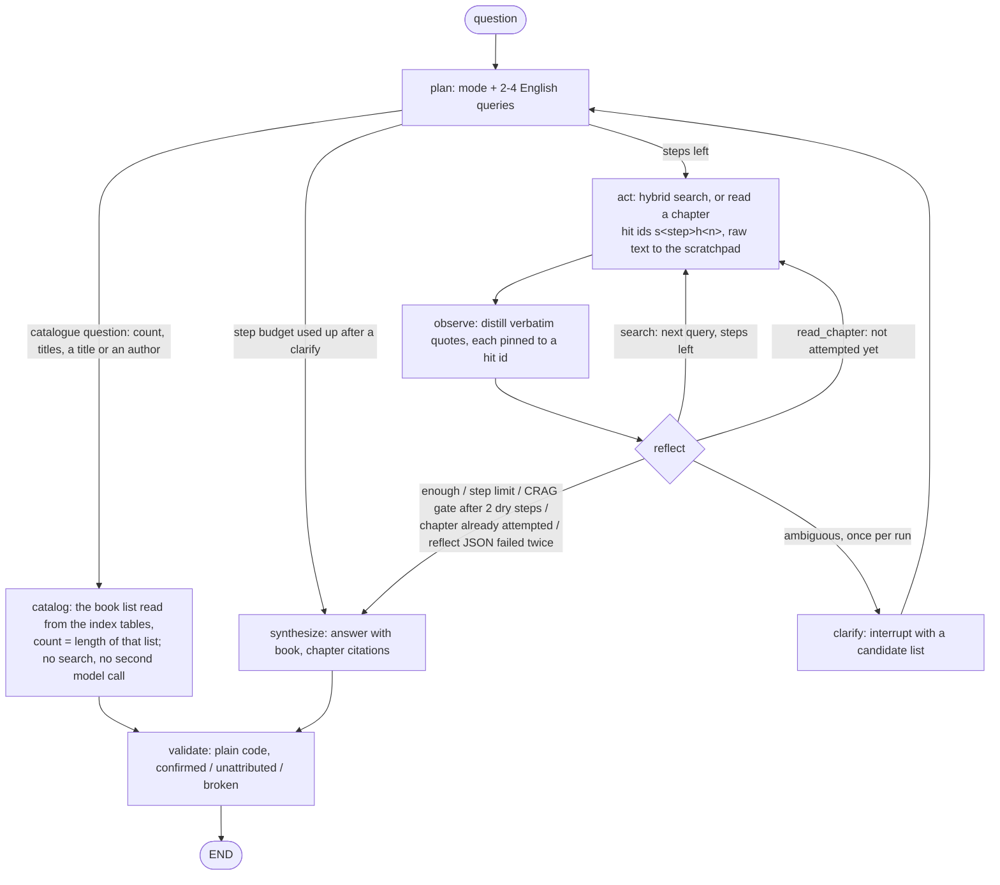
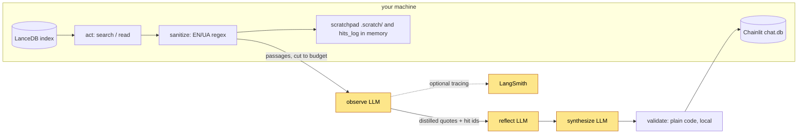

# Ask Your Library

Agentic RAG over a personal book library: a LangGraph agent plans English search queries, runs
hybrid retrieval (bge-m3 vectors + BM25, fused with RRF) over a LanceDB index, distills verbatim
evidence, reflects on whether it has enough, optionally asks a clarifying question or reads a
whole chapter, and answers with `[book, chapter]` citations. Every evidence quote the agent collected is then checked
in code against the exact passage it was copied from (the answer's own sentences are not checked claim by claim), per-node token cost is reported per
question, and the demo corpus (33 public-domain books plus 2 synthetic canaries), the golden
sets and every eval run are fingerprinted. A reference implementation with an honest eval
harness, not a "chat with your PDFs" demo. Your own books go in with one command
(`uv run ayl-add <folder>` over a folder of `.txt` / `.md` files, embedded locally by default); the
distilled book cards the demo corpus also carries still need an LLM per book and are not
generated for you.

The most instructive artifact is a failure: an answer that passes every automated gate and still
does not answer the question, because the passage that would have answered it was never retrieved -
with the mechanism explained, in
[`docs/examples/c06-fogg-missing-day.md`](docs/examples/c06-fogg-missing-day.md).

## What it does

- **Answers from your own library, with provenance.** Two corpora: distilled book cards and
  chapter-aware full-text chunks. Answers cite `[book, chapter]`; a code-based guard verifies
  each evidence quote the agent collected against the exact passage it was copied from (the
  answer's own sentences are not checked claim by claim).
- **Knows what it holds.** Questions about the library itself (how many books, which titles,
  whether a title or an author is in it) are answered by code from the index tables,
  exhaustively: the planner only names the operation, the list is read from the tables and the
  number in the answer is the length of that list (ADR-016). A content question that names one
  book is answered from that book. Content questions stay evidence-based and may be incomplete:
  a search cannot prove that nothing else matches.
- **Behaves like an agent, not a pipeline.** plan / act / observe / reflect loop with a step
  budget, a CRAG-style early stop after consecutive dry steps, chapter drill-down for detail
  questions, and a human-in-the-loop clarify interrupt when a half-remembered book matches
  several candidates.
- **Reports what it cost.** Per-node LLM calls, tokens and USD after every question, with
  retrieval selectivity (hits seen vs evidence kept) and injection-redaction counts.
- **Is measurable.** Two eval harnesses, an injection canary and a checksum-pinned corpus; every
  run records the code SHA, golden and index fingerprints and the model, so a number is always
  attributable. Runs are single and hosted-model output varies, so a changed number is a signal
  to look at, not proof of a changed system.

## Architecture



```
question -> planner queries (2-4, English) -> LanceDB hybrid search (vectors + BM25, RRF)
         -> observe distills verbatim quotes -> synthesize answers with citations
         -> validate re-checks every collected evidence quote against the passage it was copied from
```

The decisions behind this shape, and the alternative each one replaced, are recorded as ADRs
in [`docs/adr/README.md`](docs/adr/README.md), each with the measurement that settled it.

- **Hybrid retrieval.** Each corpus is searched twice (vector top-20 and BM25 top-20 from the
  LanceDB FTS index) and the lists are fused with Reciprocal Rank Fusion implemented in
  `library.py`, not via LanceDB's built-in rerankers. Manual RRF keeps the fusion transparent
  and score-scale free: only a chunk's rank in each list matters, so cosine distance and BM25
  never have to be calibrated against each other. A broken FTS index degrades to vector-only
  with a warning rather than silently.
- **Catalogue questions bypass retrieval (ADR-016).** `plan` recognises them in its one call and
  names the operation (`count`, `list`, `has` a title, `by_author`); `library.list_books()` reads
  the distinct book keys of both tables (the demo's canary fixtures excluded by their `source`
  column); code validates the operation, resolves a title or an author against that list
  (exact, contained as whole words, or a close match for a typo) and formats the answer, so
  nothing can be listed that is not in the index and a count is the length of the same list a
  listing shows. Containment reads one way: a name inside a title is a match, a title inside a
  longer name is not, in either mode: "Dracula's Guest" and "Dracula II" are different books,
  answered with a no and the closest title — for titles that is settled before the typo step,
  which on its own is close enough to confirm one ("Dracula II" is 0.824 alike to "Dracula"),
  while an author name that contains a held one still resolves ("Sir Arthur Conan Doyle" is the
  man on the shelf). The same resolver limits a content question that names one book to that
  book (a name that fits several books, or only a fragment of a title, sets no filter and claims
  nothing). The listing is exhaustive or it is an error: the full-text table is required here, as
  it is for the preflight. An operation
  the planner invents falls back to the research loop, and so does a question that also asks
  about content ("Do I have Dracula, and why does Harker stay?"): a conservative gate on content
  vocabulary sends it to the research loop, with the named book as the filter when the request
  carries a title that resolves to one book. "Who" is one of those words ("and who kills
  Lucy?"), except where it asks who wrote them: there the author is a catalogue attribute and
  the listing "Title — Author" answers that half itself. The gate reads the reader's words, not
  the library's (one mention of the title of a book the catalogue holds is taken out of the
  question before the check, so "Do I have Where the Wild Things Are?" is a holdings question
  and a book called "Why" keeps the reader's own "why"), but it knows
  words, not titles hidden in a question, so that routing stays the planner's reading, which
  the catalogue eval set measures with negative controls. The list never reaches the model: not
  in the answer, and not on a later turn (the conversation memory keeps only the operation and
  counts).
- **Only `observe` sees retrieved text, sanitized and cut to a fixed budget.** `act` writes the
  sanitized passages, cut to the same budget, to a per-run scratchpad (a human-readable log) and
  keeps each passage, as observe saw it, in state under a stable hit id; plan, reflect and synthesize work on the distilled evidence,
  never on raw hits.
- **Embedding index fingerprint.** Ingest stamps every table with the embedding model and
  dimensionality; readers refuse an index built by another model, which otherwise degrades
  retrieval silently when the dims happen to match.

### Quote provenance (not faithfulness, and not correctness)

`validate` is plain code, no LLM. Every retrieved passage gets a stable id when it is fetched
(`s<step>h<n>`), and `observe` must name the id of the passage each quote was copied from; the
book and section on an evidence item are then taken from that passage's record, never from the
model's own words. `validate` checks that the WHOLE quote, as a normalized token sequence
(punctuation and case folded, so honest typographic changes pass while paraphrase fails; signs,
range dashes and separators inside numbers are kept, with "1,200" and "1.200" treated as the
same number), is a contiguous whole-token run of the cited passage exactly as the model saw it. Three outcomes, a
partition of the evidence checked: **confirmed** (found in the cited passage), **unattributed**
(not in the cited passage, but found in another retrieved passage - reported, never counted as
confirmed) and **broken** (found in no retrieved passage). Every evidence item is checked, whether or
not the answer names its book (an answer may cite "Dracula" for the index key "Dracula — Bram Stoker");
items for books the answer does not name are counted separately for information. There is no section or
title substring matching and no fallback that confirms; the human-readable scratchpad is a log, not
an input to the check. The UI badge is green only when both unattributed and broken are zero, and
under it every evidence item opens to the passage it was checked against (verdict, book, section,
hit id, the quote, the retrieved text); `ask-library --verbose` prints the same list.

What this rules out: a fabricated sentence appended to a real one, two distant sentences
spliced into one "quote", a quote filed under the wrong passage, and service text from the
run log posing as a source. What it does not rule out is a model that copies a passage
faithfully and reasons wrongly from it.

**This verifies provenance, not correctness.** It proves the agent did not invent its evidence,
and says nothing about whether the answer is right. Concrete example: if a character in the book
lies and the agent quotes that lie verbatim from the correct chapter, provenance passes at 100%
and the answer is still factually wrong. Correctness is a human check (see Evaluation).

The numbers under Evaluation come from this validator (runs on the `v0.1.0` and `v0.2.0-rc1` code).

### Injection defense

Four layers, all partial:

1. **Regex sanitizer** (`sanitize.py`) redacts instruction-like lines from retrieved text before
   the model sees it, and counts redactions as telemetry.
2. **System/data separation.** Rules live in the system message; question, conversation, results
   and evidence go in the user message wrapped in XML-like `<result>` / `<evidence>` blocks,
   with an explicit rule that they are data.
3. **Output schemas.** Nodes return small JSON objects that are validated and degraded
   (malformed items dropped, not crashed on).
4. **Canary test** (`eval/injection_canary.py`), three outcomes: `BLOCKED` (evidence extracted,
   no canary - pass), `CONTAINED` (no evidence at all, or an empty/broken output: the dry-step
   fallback held but the injection disrupted the step, exit 2, not a pass), `FAILED` (canary
   leaked into evidence, exit 1).

What the canary covers. Five of its six stages are deterministic and free (`--no-live` runs all
available stages, and CI runs them in the `test-ui` job): the sanitizer; the `observe` controls;
the **prompt boundary** - a fake transport records the LLM prompts of `observe`, `reflect` and
`synthesize`, plus the clarify interrupt (`clarify` sends no prompt of its own, it only
interrupts), on a state whose evidence `why`/`quote`, book and section titles, queued queries
and clarify candidates all carry a marker and try to forge a delimiter, and the marker must
appear only inside data-block bodies or neutralized attributes of the *user* message, never in
the system message, with every untrusted `<` neutralized and no forged `<result>` /
`<evidence>`; the **test's own detection** - the
injection is planted in the evidence field each node really puts in its prompt (`why` for
`reflect`, `quote` for `synthesize`), each fake model asserts it actually received the marker
before echoing it, and an echo must be reported `FAILED`, a benign output `BLOCKED`, so a pass
cannot be an artefact of a blind check; and the **UI render path** - an answer and a clarify
question carrying a markdown image, a reference image and raw HTML come out inert, and so do the
two fragments the UI builds as HTML itself: the provenance badge on a broken quote and the
metrics footer on a stop reason, each carrying a blank line and an image reference.
The UI stage needs the `ui` extra; without it the stage reports `SKIPPED`, the run ends
`CANARY MECHANICS INCOMPLETE` and exits 3 unless `--allow-skipped` is passed - an incomplete run
is never reported as a pass.
What it does not cover: those stages say nothing about whether a hosted model resists an
injection. Live resistance is checked for `observe` only, by the last stage, the single paid
call in the file.

Limits: the regex layer covers English and Ukrainian phrasings only, so paraphrase, other
languages and unicode obfuscation walk past it into layer 2. The XML-like delimiters are a
prompting convention, not a security boundary - nothing enforces them. The canary exercises one
injection, not a suite.

## Quick start

**On a Mac**, one script does all of the below:

```bash
git clone https://github.com/ievgen-borysenko/ask-your-library.git && cd ask-your-library
bash scripts/install-mac.sh --dry-run    # the plan, printed; nothing is changed
bash scripts/install-mac.sh              # mostly download time, + ~30 min for the demo corpus
```

[`scripts/install-mac.sh`](scripts/install-mac.sh) installs `uv` and Ollama through Homebrew
(whose own install command it prints and never runs for you), starts Ollama for this session
only (`brew services run`, which registers no login item — the one-liner that makes it permanent
is printed at the end), pulls the two models, syncs the locked environment, writes a fully local
`.env`, asks once before the demo corpus, and finishes on the preflight the CLI runs before
every question. `--no-demo`, `--hosted`, `--yes` and `--help` are the rest of it. It never runs
`sudo`. What reaches the network is the package fetches through `brew`, `uv` and `ollama` and,
if you say yes to the demo corpus, the checksum-pinned public-domain texts
[`scripts/ingest_demo_corpus.py`](scripts/ingest_demo_corpus.py) downloads from gutenberg.org —
the two LibriVox books are not fetched, their transcripts being committed. The manual steps
below are the same thing by hand: the path on every other system, and on a Mac when you would
rather run each step yourself.

Requirements: Python 3.11+, [uv](https://docs.astral.sh/uv/), [Ollama](https://ollama.com) for
local embeddings, an OpenRouter API key for the answering model (or none at all: see
[Fully local, no account](#fully-local-no-account)).

```bash
uv sync                                  # install
ollama pull bge-m3                       # local embedding model (1024 dims)
cp .env.example .env                     # then set OPENROUTER_API_KEY in .env
uv run scripts/ingest_demo_corpus.py     # build the demo corpus (~30 min first run)
```

The ingest is staged and cached in `data/`, so it is safe to interrupt and re-run:
`--stage prepare-text|prepare-audio|prepare-canaries|ingest|cards` runs one stage, `--book <substring>`
re-ingests a single book in place. Sources are checksum-pinned in `corpus/manifest.yaml`
(`--no-verify` to skip). The text path works on any OS; two books come from LibriVox audio and
their Whisper transcripts are committed under `corpus/prepared-audio/`, so the full corpus
builds everywhere. Running the transcription itself (`--retranscribe`) needs macOS with MLX
Whisper.

Your own books instead of (or beside) the demo corpus — see
[Add your own books](#add-your-own-books):

```bash
LIBRARY_DB_PATH=~/ayl-index uv run ayl-add ~/books
LIBRARY_DB_PATH=~/ayl-index uv run ask-library "..."
```

```bash
uv run ask-library "What does Marcus Aurelius say about anger?"
uv run ask-library                       # interactive chat with conversation memory
uv run ask-library --verbose "..."        # plus every evidence item with the passage it was checked against

# web UI (Chainlit, same core as the CLI), bound to loopback; throwaway local demo, admin / change-me:
# the login form's first field is labelled "Email address"; type the username there
AYL_ALLOW_DEFAULT_LOGIN=1 uv run --extra ui chainlit run ui.py -w --host 127.0.0.1
# with a real password (the UI refuses to start on the placeholder one):
CHAINLIT_USERNAME=... CHAINLIT_PASSWORD=... uv run --extra ui chainlit run ui.py -w --host 127.0.0.1

# evals
uv run eval/run_retrieval_eval.py        # no LLM calls, free
uv run eval/run_agent_eval.py            # full agentic loop over the golden set
uv run eval/injection_canary.py          # one LLM call (the last stage)
uv run --extra ui eval/injection_canary.py --no-live  # all available stages, no LLM call, free
uv run --group dev pytest -q             # unit tests, the compiled graph end to end with a scripted model, golden-set/manifest guard
```

## Fully local, no account

Indexing your own books needs no account by default: `ayl-add` chunks locally and embeds with Ollama's
`bge-m3` by default. Only the answering model needs OpenRouter. To run everything on this machine:

```bash
ollama pull qwen3.6                        # or any chat model; the default OLLAMA_LLM_MODEL
LLM_BACKEND=ollama uv run ask-library "..."        # no key, cost lines read $0.0000
LLM_BACKEND=ollama uv run --extra ui chainlit run ui.py -w --host 127.0.0.1   # the UI's key gate is off in this mode
```

`OLLAMA_LLM_MODEL` picks the model; preflight fails early if it is not pulled (a model pulled as
`name:latest` counts as `name`), and so does `OLLAMA_EMBED_MODEL` whenever embeddings are local —
otherwise a reachable Ollama without `bge-m3` passes every check and fails on the first search.
Preflight also separates the two ways `OLLAMA_URL` can disappoint: nothing answered at all
("could not reach Ollama" — nothing is listening, or the request timed out; start with
`ollama serve` and the URL) versus something that answered but did not answer as `/api/tags` — an
HTTP 4xx/5xx, a body that is not JSON, or an unexpected shape — which usually means something other
than Ollama is on that port, and the message names the status it got. The reply is read whenever
anything runs on Ollama, embeddings included, so the default hosted-model setup gets the same early
failure. Everything else is
unchanged: the same graph, the same provenance check, the same eval harness (every report names
the local model in its fingerprint). What is not the same is quality: every number in this README
was measured with the OpenRouter default (`anthropic/claude-sonnet-4.6`), and the agent nodes
expect strict JSON, which small local models return less reliably. A malformed reply is retried
once with the parse error shown to the model; if it fails again, `observe` keeps no evidence from
that step, `reflect` stops the loop ("no usable decision") and `plan` searches the raw question
as its one query and says so in the plan step and in the eval report. Measure your model on the
core set before trusting it: `LLM_BACKEND=ollama uv run eval/run_agent_eval.py`. In this mode the answering model is configured by the `OLLAMA_*`
variables only (`OLLAMA_LLM_MODEL`, `OLLAMA_URL`, optional `OLLAMA_PRICE_*`): `ORCHESTRATOR_MODEL`
and the OpenRouter prices in a copied `.env` are OpenRouter settings and are not applied, so
nothing goes to OpenRouter by accident; `OPENROUTER_BASE_URL` keeps serving `EMBED_BACKEND=openrouter`
if you use it. An unknown `LLM_BACKEND` value refuses to start rather than falling back to the
hosted provider. "Nothing leaves the machine" holds with the defaults `EMBED_BACKEND=ollama`, an `OLLAMA_URL` that
points at this machine, and no LangSmith tracing. Tracing is switched on by the environment, and the
SDK reads two prefixes: `build_graph` sets `LANGCHAIN_TRACING_V2=true` whenever `LANGCHAIN_API_KEY` is
present and that variable is unset, and the SDK itself honours `LANGSMITH_TRACING` /
`LANGSMITH_TRACING_V2` with `LANGSMITH_API_KEY`, which another project's shell may have exported. To
keep tracing off whatever the environment inherited, set both `LANGSMITH_TRACING_V2=false` and
`LANGCHAIN_TRACING_V2=false` (the `*_TRACING_V2` variables take precedence over the legacy
`*_TRACING` ones, and the `LANGSMITH_` prefix over `LANGCHAIN_`; `tests/test_tracing_recipe.py` pins
this against the installed SDK). Prompts and retrieved text would otherwise go to LangSmith.

## Add your own books

```bash
LIBRARY_DB_PATH=~/ayl-index uv run ayl-add ~/books          # index a folder
LIBRARY_DB_PATH=~/ayl-index uv run ayl-add ~/books --dry-run  # what it would index, no writes
LIBRARY_DB_PATH=~/ayl-index uv run ask-library "..."        # ask it
```

Every `.txt` / `.md` file under the folder (recursively) is **one book**. Skipped, and reported
on stderr: hidden files and directories; **symlinks** — in or out of the folder, including files
under a symlinked directory; files that are not UTF-8 text; and files with nothing but a front
matter block or a title line. A link is not followed, so nothing outside the folder is ever read
or embedded; copy the file in if you want it indexed. One bad file never aborts the run — the
others are still indexed, and every skip is named on stderr (hidden ones as a single line with
the count and the first few names, so one hidden directory cannot bury the rest). Only a folder
in which *nothing* is indexable is an error, and then the existing index is left untouched.

Re-running the command re-indexes: a book's rows are replaced, never appended, so `ayl-add` on
the same folder twice leaves the index unchanged, and adding a folder to an existing index leaves
the books already in it alone. The update is **staged**: every book of the run is embedded into a
staging table, together with the rows of the books that stay, and the live table is only replaced
once that staging table is complete, with the FTS index and the fingerprint rebuilt right after.
An embedder that dies on book 7 of 20 therefore leaves the index exactly as it was — the price is
that an update rewrites the whole table, so adding one book to a large library costs a full
rewrite (embeddings are only computed for the books of the run). That rewrite is **streamed**:
the existing rows are read and republished in Arrow record batches of 2,000 rows, so the run
holds one batch plus the current book's chunks in memory, not the index. The disk and time cost
still scale with the index — a rewrite copies every row — and LanceDB keeps the previous table
files until its own cleanup, so a large index briefly needs room for both copies.

**The book key** is `Title — Author` — the string the agent cites and filters chapter reads on.
It is taken from, in priority order:

1. a YAML front matter block at the top of the file (`title:`, `author:`);
2. the first line, when it is a standalone title line — a Markdown heading, or a short line
   followed by a blank one — in the form `Title — Author` or `Title by Author`; that line is then
   dropped from the book text;
3. the file name: `Title - Author.txt` → `Title — Author`; a plain `Title.txt` →
   `Title — Unknown`.

Two files that resolve to the same key are refused rather than merged; give one of them front
matter. The row key derived from the key keeps a short digest of it (`the-green-ledger-…-9f2c1b04`),
so two titles that reduce to the same ASCII slug — two Cyrillic titles, say — stay two books
instead of one silently overwriting the other.

**Chapters** come from Markdown `#` / `##` headings (a lone `#` above `##` headings is read as
the book title, not a chapter), else from the same whole-line prose heuristic the demo corpus
uses (`CHAPTER IV.`, `STAVE ONE`, `LETTER 3`, …), else the file becomes a single section named
`Full text`.

**Nothing in your file is dropped, and nothing spurious is added.** Every heading becomes a
section, however short its text — a two-line `CHAPTER I` is a chapter — and the text before the
first heading is kept as a section named `Front matter`; a heading with nothing under it keeps a
section too, with the heading line as its text. The one exception is a table-of-contents line in
a `.txt` file (Markdown headings are taken as written), and it is still not dropped: a prose
heading whose text runs to fewer than
200 characters **and whose title reappears later in the file** is read as a contents entry, so
its heading line and its text are merged into the section above it (into `Front matter` when it
comes before the first real section) instead of opening one. That test is deliberately narrow —
a short heading whose title never comes back is a genuinely short chapter and keeps its own
section — and it is a heuristic, not a parser of book structure: a short real `CHAPTER I` in a
volume whose numbering restarts in the next volume is read as a contents line and merged (reported,
never lost); if that shape matters to you, split the volumes into files. Both halves of the rule
matter: without the merge, the contents page of a raw Gutenberg `.txt`
took the bare names `CHAPTER I`, `CHAPTER II`, … for its one-line entries and the real chapters
were renamed `CHAPTER I (2)`, so drilling into chapter one landed on a line of the contents
page. Every merge is reported: one warning per heading (its title, how much text followed it,
where the text went) and a `N short headings merged into their preceding section` count in the
run summary and in `--dry-run`.

Section names are then made unique within the book (`Chapter I`, `Chapter I (2)`, and so on
until the name is free, so a file that already contains a `Chapter I (2)` still gets three
distinct sections). Uniqueness is not cosmetic: the section name is part of the chunk id and is
how the agent addresses a chapter when it drills down, so two sections sharing a name would read
as one. The demo corpus is cut more aggressively — it *discards* contents lines and short
chapters, with a pinned manifest behind that — but your own files lose no text, and `--dry-run`
lists every section that would be indexed.

**Local vs paid.** `ayl-add` makes no paid calls by default (`EMBED_BACKEND=openrouter` is the exception): chunking is local, embeddings are computed by
your local Ollama (`bge-m3`), and the LanceDB is written on your machine. Only asking questions
costs money — the orchestrator LLM, roughly $0.03-0.04 per question on the demo set (see the
eval artifacts). `EMBED_BACKEND=openrouter` would send your book text to the embedding API too;
the default does not.

**What you do not get:** book cards. The demo corpus carries a distilled card per book (plot,
characters, takeaways) as a second corpus, and generating one costs an LLM call per book, so
`ayl-add` does not make them — `--cards` prints that and exits. An index without a
`cards_<backend>` table is fully supported: the agent searches full text only and says so — the
preflight reports it as a notice (not an error) at CLI start-up and in the web chat welcome, and `library.search` logs it once
per process. Answers are still cited and quote-checked; broad "what is this book about" questions
are simply weaker without cards.

`ayl-add` writes into an existing table only when the table's fingerprint (`index_meta`) matches
the configured embedder exactly — same model, same dims. A table built by another model, and a
table with **no** fingerprint at all (matching dims prove nothing about the model), are both
refused before anything is embedded: one table, one model. Stamp a known-good unstamped table
with `uv run scripts/ingest_demo_corpus.py --stage stamp-meta`, or rebuild it.

Prefer to build the index yourself? The table contract is unchanged: `transcripts_<backend>`
(and optionally `cards_<backend>`) with columns `chunk_id, note, book, source, section, text,
vector`, stamped via `index_meta.write_index_meta`. `ayl-add` is that contract with a CLI in
front of it.

## Configuration

All settings are environment variables (`.env` in the repo root is loaded; exported variables
win). See `.env.example`.

| Variable | Default | Purpose |
|---|---|---|
| `LIBRARY_DB_PATH` | `data/lancedb` | LanceDB with `cards_<backend>` / `transcripts_<backend>` |
| `EMBED_BACKEND` | `ollama` | `ollama` (local bge-m3) or `openrouter`; also selects the table suffix |
| `OLLAMA_URL` | `http://localhost:11434` | Local Ollama endpoint |
| `OLLAMA_EMBED_MODEL` | `bge-m3` | Embedding model, 1024 dims, multilingual |
| `OPENROUTER_EMBED_MODEL` | `openai/text-embedding-3-small` | Embeddings when `EMBED_BACKEND=openrouter`, 1536 dims |
| `LLM_BACKEND` | `openrouter` | `ollama` runs every agent node on a local model through Ollama's OpenAI-compatible endpoint: no key, no cost |
| `OLLAMA_LLM_MODEL` | `qwen3.6` | Local model for the agent nodes when `LLM_BACKEND=ollama` (must be pulled; preflight checks). In that mode the answering model runs at `OLLAMA_URL/v1`; `ORCHESTRATOR_MODEL` and `PRICE_*` are not applied; `OLLAMA_PRICE_IN_PER_MTOK` / `OLLAMA_PRICE_OUT_PER_MTOK` (default 0) price the local model if you want to |
| `OPENROUTER_API_KEY` | (unset) | Required when the answering model or the embeddings come from OpenRouter; not needed with `LLM_BACKEND=ollama` and the default local embeddings |
| `OPENROUTER_BASE_URL` | `https://openrouter.ai/api/v1` | Any OpenAI-compatible endpoint works; serves the answering model when `LLM_BACKEND=openrouter` and the embeddings when `EMBED_BACKEND=openrouter` |
| `OPENROUTER_ENV_FILE` | (unset) | Opt-in file scanned for the key; never read unless set |
| `ORCHESTRATOR_MODEL` | `anthropic/claude-sonnet-4.6` | Model for all agent nodes |
| `MAX_OUTPUT_TOKENS` | `2048` | Hard output cap per call; without it the provider pre-authorizes the model maximum |
| `SEARCH_HIT_CHARS` | `2500` | Characters of each search hit that `observe` sees (and the quote check compares against); 1,200 until 0.1.0 |
| `CHAPTER_HIT_CHARS` | `12000` | Characters of a chapter read that `observe` sees; the cut is marked in-band |
| `MAX_STEPS` | `4` | Search or chapter-read steps per question; the eval fingerprint names it |
| `MAX_EMPTY_STREAK` | `2` | CRAG gate: the loop stops after this many dry steps in a row |
| `MAX_CLARIFY_CANDIDATES` | `5` | Longest list of books a clarify question offers; at most 5, the ordinals the reply resolver understands |
| `LLM_TIMEOUT_S` | `120` (`600` with `LLM_BACKEND=ollama`) | Per-attempt read/write timeout of one model call (the SDK's default was 600 s; connect stays 5 s) |
| `LLM_MAX_RETRIES` | `2` | Extra attempts the client makes on a timeout or a transient provider error (the SDK's default, now explicit); on those failures a call takes up to timeout x (1 + retries) plus the SDK's backoff (see Known limits: a slowly streaming response is not bounded) |
| `QUESTION_DEADLINE_S` | `300` | Time budget per question, checked before each next decision: the loop stops searching and answers from what it found, stop reason shown; clarify waiting time excluded; `0` = none; `ask-library --deadline` overrides it for a run |
| `PRICE_IN_PER_MTOK` / `PRICE_OUT_PER_MTOK` | `3.0` / `15.0` | USD per 1M tokens, for the cost estimate |
| `ASK_LANG` | `en` | UI language: `en` or `ua` |
| `ASK_SCRATCH_DIR` | `.scratch` | Where raw-hit scratchpads are written (a human-readable log; `validate` does not read it) |
| `GOLDEN_PATH` | `eval/golden/en-demo.yaml` | Golden set used by both eval harnesses |
| `EVAL_RESULTS_DIR` | `eval/results` | Eval reports and per-question scratchpads |
| `AYL_STRICT_HIT_ID` | `1` | Evidence must name the `hit_id` it was copied from or it is dropped; `0` resolves a missing id by finding the hit that contains the quote (still evidence-based) |
| `LANGCHAIN_API_KEY` / `LANGCHAIN_PROJECT` | (unset) / `ask-your-library` | Setting the key enables LangSmith tracing (`build_graph` sets `LANGCHAIN_TRACING_V2=true`); the SDK also reads `LANGSMITH_API_KEY` with `LANGSMITH_TRACING[_V2]=true` |
| `LANGCHAIN_TRACING_V2` / `LANGSMITH_TRACING_V2` | (unset) | Set both to `false` to keep tracing off whatever the environment inherited: `LANGSMITH_TRACING_V2` is read first, then `LANGCHAIN_TRACING_V2`, then the legacy `*_TRACING` flags |
| `CHAINLIT_USERNAME` / `CHAINLIT_PASSWORD` | `admin` / `change-me` | Web UI login |
| `CHAINLIT_AUTH_SECRET` | generated | Signs login tokens; persisted to `.chainlit/auth-secret` |
| `AYL_CHAINLIT_DIR` | `.chainlit/` next to `ui.py` | Where the UI writes its chat db and auth secret; tests and the canary point it at a temp dir |
| `AYL_ALLOW_DEFAULT_LOGIN` | (unset) | `1` allows the placeholder password (local demo only) |
| `AYL_ALLOW_START_WITHOUT_KEY` | (unset) | `1` lets `ui.py` be imported without an OpenRouter key (tests, the injection canary); the server otherwise refuses to start, before anyone can log in |
| `ASK_DEBUG` | (unset) | `1` re-raises CLI errors instead of printing a message |

`ask-library --help` and `ask-library --version` need none of it: they print and exit before
the preflight, so they work in a fresh clone with no key and no index.

## Evaluation

**`eval/run_retrieval_eval.py` - component baseline, no LLM calls.** Feeds the *raw* golden
question to the retriever and asks whether the resulting window (top-4 card chunks + top-4
transcript chunks, exactly what `search_both` gives the agent) contains the expected book(s).
Single-book questions score presence; multi-book questions score coverage and whether *all*
expected books are present. Per-corpus hit@k and MRR are diagnostics only. This measures the
retriever with the raw question; the agent rewrites the question into its own queries, so this is a
component baseline, not a bound on agent quality in either direction.

**`eval/run_agent_eval.py` - behavioural scoring of the full loop.** Every golden question runs
through the whole graph (clarify interrupts are auto-answered, so the run is non-interactive),
scored on: expected titles mentioned in the answer (accent-folded substring, not a citation
check), refusal questions answering with an explicit refusal (an evidence-free answer told from
model knowledge fails), `expected_behavior: clarify` questions actually triggering a clarify
interrupt, `expects_chapter_read` questions actually drilling into a chapter of an expected
book, and `catalog` questions on their structured result (the set of books the code listed must
equal the expected set of index keys, "Title — Author", so the right title under a wrong author
fails; the count must be the length of that list, the operation must be the one
the item names, and the catalogue as a whole must hold the `expected_total` the item was written
for, or a run of two or three items could certify a partial index; a research question answered
by the catalogue path fails, and so does a research control the planner did not route itself,
where a planner or catalogue fallback searched instead). Quote provenance totals come from
`validate`. Scoring is heuristic, no LLM judge -
**answer correctness is still a manual read**, which is why the harness writes every answer
into a report with a per-question correctness checkbox.

Three golden sets, reported separately. **Core** (`eval/golden/en-demo.yaml`, 11 questions, the
default `GOLDEN_PATH`): eight questions on books the golden author has read and a two-book
comparison of two of them (Ivanhoe and Don Quixote), all nine reader-verified; h06, one of the two
questions the example traces are built on, verified against the source text by an AI session only;
and one genuinely ambiguous identify (Crusoe or Gulliver), proposed and awaiting the reader's
verdict on the item itself. Each item's notes state its level. The file held twelve questions when
the v0.1.0 column was measured; the reader removed h12 on 06.09, and the v0.2.0-rc1 column is the
eleven-question set (see the note under the table).
**Extended**
(`eval/golden/en-demo-extended.yaml`, 21 questions) is the former v3 draft with near-duplicates
removed; its notes were checked against the source text by an AI session only, so its numbers are
exploratory.
**Catalogue** (`eval/golden/en-demo-catalog.yaml`, 10 questions): six questions about what the
library holds (count, the full list, a title that is there, one that is not, an author, the count
in Ukrainian), scored on the structured result against the manifest's book keys and its size;
three content questions
that look like listings as negative controls (one scored on routing alone); and one hybrid item
that pins the named-book retrieval filter. Measured on `50b9347` (09.09, single run, the branch's
final commit with the scoring on keys and `expected_total`; the earlier 10/10 run of the same day
on `b0d1321` scored titles only and has a different golden checksum, so it is not the same
measurement): 10/10; the six catalogue items with 0 search steps and one model call each; the three
controls through the research loop (1, 2 and 3 steps); the hybrid item with retrieval limited to
Dracula; 22/22 quotes confirmed on the four research items; $0.17 for the set, of which the six
catalogue items cost $0.014 together (`docs/eval-results/2026-09-09-catalogue-set.md`).

Two measured trees, both single runs, clean tree (`--require-clean`), strict hit-id mode, the same
bge-m3 index: **v0.1.0**, 2026-09-05 on code `88881ee` (the last code commit before tag `v0.1.0`;
the tag's commit adds documentation only), with a 1,200-character observe window, summarised in
`docs/eval-results/2026-09-05-v0.1.0-*.md`; and **v0.2.0-rc1**, 2026-09-07 on tag `v0.2.0-rc1`
(`33dba3f`), with the 2,500-character window (ADR-012) and the coverage gate (ADR-013) together
plus everything in the 0.2.0-rc1 changelog. The rc1 reports
`docs/eval-results/2026-09-07-v0.2.0-rc1-{core,extended,retrieval-canary}.md` are the harness
output verbatim under a provenance header (the two targeted second-candidate runs are appendices of
the core and extended reports); every agent row carries its stop reason and would say so if the
planner had fallen back or the deadline had cut the search (neither happened on either set). The
window and the gate were introduced and measured one at a time during development (the CHANGELOG
records those steps); the two columns below are the first measurement of both on one run: +39% per
core question and +57% per extended question against v0.1.0 (from the committed totals, $0.5364/11
against $0.4215/12 and $0.9008/21 against $0.5722/21).

A third run of the core set, 2026-09-09 on `50b9347` (the catalogue branch's final commit, this
repository), checks that the catalogue path (ADR-016) left the research loop's numbers where they
were: 11/11 behaviour, 48 / 0 / 0 quotes confirmed / unattributed / broken, $0.0519 mean per
question against $0.0488 on rc1 (73 model calls against 70). What changed is the path, not the
verdicts: the three questions that name one book (c04, c05, c06) now run with retrieval limited to
that book by the catalogue resolver, and the refusal question's answer carries the note that the
named book is not in the catalogue. Single run, not reader-graded; the report is
`docs/eval-results/2026-09-09-catalogue-branch-core.md`. The table below keeps the two tagged
baselines.

### Where the measured code lives

The measurements were made in the private development repository before this repository was
created, and the reports name that repository's commits (`33dba3f`, `88881ee`, `1222b09`, ...):
those identify the measured trees in that history, they are not commits you can check out here,
and they are kept as recorded because rewriting them would suggest that a different code was
measured. What you can check instead: the first commit of this repository carries the eval harness
(`eval/*.py`) and `scripts/ingest_demo_corpus.py` byte-identical to the measured `33dba3f`, `src/`
and `ui.py` identical up to one comment line each (a review credit removed; the launch command in
the `ui.py` docstring completed with `--host 127.0.0.1`), and `eval/golden/en-demo.yaml` identical
except for one editorial note on c09 (a review credit removed after the run; the questions are
unchanged, and the core report's header records the resulting checksum change); the other
differences are documentation, the eval reports themselves and the version string. Reports of intermediate development runs are
not exported; the ones here are the tagged baselines the text refers to. The export from the
development repository is done by a private allowlist tool (a deny-by-default file list, a
private-marker grep and a gitleaks scan) that is not part of this repository.

| Measurement | Core v0.1.0 (12 questions, window 1,200) | Core v0.2.0-rc1 (11 questions, 2,500 + gate) | Extended v0.1.0 | Extended v0.2.0-rc1 |
|---|---|---|---|---|
| Retriever window, single-book presence | 9/9 | 8/8 | 12/12 | 12/12 |
| Retriever window, multi-book full coverage | 2/2 | 2/2 | 3/5 | 3/5 |
| Agent eval, questions completed | 12/12 | 11/11 | 21/21 | 21/21 |
| Behavioural compliance (heuristic scorer: titles, refusal, clarify, drill-down) | 12/12 | 11/11 | 17/21 | 18/21 |
| Answer quality, correct / incorrect / incomplete (AI pre-check of that run; the reader's own verdicts on the v0.2.0-rc1 run are in `docs/eval-results/2026-09-07-v0.2.0-rc1-core.md` and confirm the pre-check: 10 correct, c06 incomplete; the v0.1.0 run was not graded by the reader) | 9 / 1 / 2 | 10 / 0 / 1 | not scored | not scored |
| Quote provenance, validator v0.1: confirmed / unattributed / broken | 46 / 0 / 0 | 47 / 0 / 0 | 53 / 0 / 0 | 73 / 0 / 0 |
| Clarify where the golden requires it | 1/1 | 1/1 | 0/2 | 1/2 |
| Chapter drill-down where expected | not in set | not in set | 0/1 | 0/1 |
| Cost per question, mean (Sonnet 4.6 via OpenRouter, configured rates) | $0.035 | $0.049 | $0.027 | $0.043 |

h12 was removed from the core set by the reader on 06.09 (never reader-verified; a character's lie
taken as fact was its failure); the v0.1.0 column is the 12-question run, the v0.2.0-rc1 column the
11-question core, which is also why the retriever row reads 8/8 there (h12's row is gone, nothing
else changed in retrieval: the index is the same).

On v0.1.0, behavioural compliance and provenance are green on all twelve core answers; a read of the
same answers against the golden notes finds one wrong (h12, then still in the set: a character's false
accusation reported as fact) and two incomplete: c03 names Madame Coquenard but not
Madame de Chevreuse, c06 never reaches Passepartout's
"to-day is Saturday" and says so (the committed trace). On v0.2.0-rc1 the AI pre-check of the eleven
answers finds ten correct and one incomplete, and the reader's read of 07.09 agrees row by row: c06 again, in a different shape: it reads Chapter
XXXIV, quotes Fix's apology from it, and supplies the date-line explanation from the book card's
plot summary instead of the discovery scene (Chapter XXXVII was not retrieved), without saying that
the scene itself is missing; Passepartout's "to-day is Saturday" and the Reform Club dash are
absent; c03 names both women this time and hedges Madame de Chevreuse as not
clearly established by the passages; c09, reworded on 05.09 to name both readings of the question,
offers Crusoe and Gulliver as candidates, answers Crusoe
with the harness's "not sure" reply and, with the second candidate chosen (`--clarify-pick second`,
committed as a one-question run), applies the choice and answers from Gulliver's Travels. The
extended failures are the known agent gaps under Known limits: on v0.1.0 four (q06 and h22 no
clarify, h17 Doyle side never retrieved, h13 no drill-down), on v0.2.0-rc1 three (h22 now clarifies
and offers Frankenstein and Dracula; q06, h17 and h13 unchanged).

Private cross-lingual library (Ukrainian questions over an English corpus, 10 questions, not in
this repo): single-book presence 6/7, multi-book coverage 1/3. The honest hard case - a
multilingual embedder handles single-target questions across languages, cross-lingual
aggregation does not hold up.

### Where the quality comes from

**`eval/run_ablation.py` - the same twelve core questions under five conditions** (ADR-014; the
architecture decision records are in [`docs/adr/README.md`](docs/adr/README.md)), one run
each on 2026-09-05, code `ab4e458` (`88881ee` plus the ablation harness - `eval/run_ablation.py`,
`tests/test_ablation.py` and their two entries in the private export allowlist - which
changes nothing the agent runs), clean tree, same index and same model as the table above. It
answers "how much of this is the agent loop and how much is the model, the corpus or plain
retrieval?". `no-context` is the orchestrator model with the question and nothing else;
`retrieve-answer` is one `search_both` call feeding one synthesize prompt, no loop; `cards-only`
and `transcripts-only` are the full loop with retrieval restricted to one corpus (a window of 4
hits per step instead of 8); `agent` is the shipped loop.

| condition | behaviour PASS | expected titles | provenance conf/unatt/broken | AI pre-check corr/incorr/incompl | mean cost/question |
|---|---|---|---|---|---|
| `no-context` (no library at all) | 6/12 | 9/13 | n/a | 9 / 1 / 2 | $0.0048 |
| `retrieve-answer` (retrieve once, answer once) | 9/12 | 12/13 | n/a | 7 / 2 / 3 | $0.0122 |
| `cards-only` (loop, cards corpus) | 12/12 | 13/13 | 29 / 0 / 0 of 29 | 8 / 0 / 4 | $0.0240 |
| `transcripts-only` (loop, transcripts corpus) | 11/12 | 12/13 | 33 / 0 / 1 of 34 | 9 / 1 / 2 | $0.0335 |
| `agent` (the shipped loop) | 12/12 | 13/13 | 40 / 0 / 0 of 40 | 9 / 1 / 2 | $0.0328 |

**On this run the full loop is not better than the loop-free conditions on answer content**: it
reads 9 correct / 1 incorrect / 2 incomplete, and so does the model with no library at all. Nine of
the twelve questions are about world-famous classics the model already knows, so on this corpus the
ablation cannot separate the loop from model memory on correctness. What the loop demonstrably buys
is in the other columns - behaviour PASS 6/12 to 12/12, quote provenance, and the clarify interrupt
- at 6.8x the cost of answering from memory. Provenance comes from the evidence-and-validation
contract, which this ablation did not separate from the loop: a single retrieval followed by the same
extraction and check would carry it too; the loop's own contribution is the extra steps and the clarify. Two results
cut the other way: the single-corpus `transcripts-only` condition beats the full agent on c03 (the
mechanism is not established by this run: each corpus keeps its own four hits, so cards do not
displace chapter text in retrieval; the difference is in what `observe` selected from eight hits
instead of four, or plain model variance), and on h12 - a former core item, removed by the reader
on 06.09, whose rows this artifact keeps as the record of the run - the three conditions whose
window carried a character's lie verbatim all repeated it as fact with clean provenance, while the
two that never saw it answered correctly. The `agent` condition reproduces the `v0.1.0` core run's
pre-check exactly - 9 / 1 / 2, the same three questions - which is a consistency check across two
independent runs, not a second measurement. Full table, per-question pre-check and limits:
[`docs/eval-results/2026-09-05-ablation-core.md`](docs/eval-results/2026-09-05-ablation-core.md).
The pre-check column is an AI reading of every answer against the golden notes by the session that
ran the ablation, not a human verdict.

### What the green numbers do NOT prove

- **Not correctness.** A 100% confirmed quote-provenance score means every quote really came
  from a hit of the book it is attributed to. If a character makes a false claim and the agent
  quotes it verbatim from the right chapter, provenance passes and the answer is still wrong; and
  a question whose answering passage was never retrieved scores the same green as one that was.
  Only a correctness read of the report catches either (the AI pre-check did, and on 07.09 the
  reader graded the eleven v0.2.0-rc1 answers in their report: ten correct, c06 incomplete).
- **Not answer quality.** Behavioural PASS means the expected titles were mentioned, a refusal
  refused, a clarify clarified. It does not grade reasoning or prose. c06 (Fogg's missing day)
  is PASS with provenance 2/2 and does not answer the second half of its question: the scene that
  answers it, Passepartout's "to-day is Saturday" in Chapter XXXVII, never entered the retrieval
  window, so the answer states honestly that the discovery moment is not in the evidence. That
  failure and a clean success are committed as full traces in
  [`docs/examples/`](docs/examples/README.md).
- **Not that the model read what it cites.** c06 in the 05.09 core run cited
  a Chapter XXXVII passage whose 1,200-character window ended one line before Passepartout's
  "to-day is Saturday" and inverted the day of the week; on the v0.1.0 run that chapter is not in
  the window at all and the answer stops short and says the discovery moment is not in the
  evidence; on the v0.2.0-rc1 run it is not in the window either and the answer fills the gap from
  the book card's plot summary without saying so. PASS and green provenance every time. Widening the observe window (measured during
  development, ADR-012) does not fix c06, because the passage is not in the window to widen. c05 (the windmills) once read an empty chapter because `reflect` passed the
  bare title while the index keys rows as "Title — Author"; fixed, and the tagged run quotes the Friston passage.
- **Not generalization.** The demo corpus is 33 classics with a golden set written against them.
  Numbers on your own library will differ.

## Privacy and data flow

Run this on your own machine, over books you legally own.



Yellow boxes leave the machine (the LLM provider, optionally LangSmith); everything else stays local.

- The question **and retrieved corpus fragments** go to the orchestrator LLM provider -
  OpenRouter by default, and on to the model vendor. Point `OPENROUTER_BASE_URL` elsewhere to
  change that, or set `LLM_BACKEND=ollama`: with local embeddings (the default) and tracing off,
  nothing leaves the machine at all.
- A catalogue answer (the list of your books) is computed locally from the index tables and is
  not sent to the provider; the conversation memory keeps only its shape (the operation and the
  counts, and the name you asked about), so a later question does not carry the titles either.
  Two different guarantees: the list never reaches the *model*; a *tracing exporter*, when you
  enable one, receives the graph state, the catalogue list and the answer included, like every
  other run's state. Keep tracing off (the recipe under Configuration) if the list must stay
  on the machine.
- Embeddings are computed **locally** by Ollama by default; nothing leaves the machine for
  retrieval. `EMBED_BACKEND=openrouter` sends chunk text to the embedding API too.
- Every run writes a scratchpad with the **retrieved passages as the model saw them** (sanitized,
  cut to 2,500 characters per search hit and 12,000 per chapter read; `SEARCH_HIT_CHARS` and
  `CHAPTER_HIT_CHARS` in the environment set the two cuts) to `.scratch/` (gitignored,
  never cleaned up automatically).
- The Chainlit UI stores chats, questions and answers included, in `.chainlit/chat.db` (SQLite).
- Optional LangSmith tracing (`LANGCHAIN_API_KEY`, or `LANGSMITH_API_KEY` with `LANGSMITH_TRACING`)
  sends prompts and retrieved text to LangSmith; `LANGSMITH_TRACING_V2=false` and
  `LANGCHAIN_TRACING_V2=false` together keep it off.

All local storage is persistent, plaintext and unencrypted. There is no retention policy and no
cleanup command.

## Threat model

Designed for **localhost, single user**. Not designed for internet exposure:

- No rate limiting, no spend cap beyond `MAX_OUTPUT_TOKENS` per call and the per-question deadline, no per-user budget. An
  exposed UI is an open bill.
- Chainlit auth is a single username/password pair: no multi-user isolation and no per-book
  entitlement check (the `canary-authz` book is a placeholder for a future entitlements PoC, not
  an enforcement mechanism).
- **Loopback is not private to your machine.** Any page open in your browser can send requests
  to `127.0.0.1` (it only has to guess the port), and a name it controls that resolves to
  `127.0.0.1` (DNS rebinding) makes those requests same-origin for the browser, carrying that
  name in the `Host` header. That is why the quick start's placeholder login is unsafe even with
  no port forwarding at all: such a page could post it and then read every thread. `ui.py`
  registers Starlette's `TrustedHostMiddleware`, so the server answers only to the Host headers
  `localhost` and `127.0.0.1` and returns 400 to anything else, which closes the rebinding route;
  the login cookie is `SameSite=strict`, which `ui.py` sets on Chainlit's cookie module itself
  (`CHAINLIT_COOKIE_SAMESITE` is read before `ui.py` is loaded under `chainlit run`, so neither
  the environment nor `.env` decides it). Set `CHAINLIT_PASSWORD` anyway. `allow_origins` in
  `.chainlit/config.toml` is a CORS list, i.e. what a cross-origin page may *read*, and never a
  substitute for either.
- The injection layers cover instructions embedded in the *corpus*. They do not protect against
  a hostile *user*, do not cover paraphrased or non-EN/UA injections, and do not make the
  XML-like data blocks a boundary.
- `get_chapter`'s filters are `lancedb.expr` expressions pushed down as expressions, so the
  model-supplied book and section travel as literals and no SQL is rendered here. The one
  interpolated filter that still takes model-supplied input is `library.search`'s book filter
  (`_sql_quote`, quotes escaped): a known rough edge, recorded in `docs/backlog.md`
  (`index_meta.py` interpolates too, but only the configured table name).

## Known limits

From `docs/backlog.md`, confirmed by the runs of 2026-09-05, 06 and 07 (`v0.2.0-rc1`):

- **Identify mode can still stop at one book.** The coverage gate (ADR-013, since 0.2.0-rc1) spends the
  planner's next queued query before `reflect` may say "enough" with a single book, which is
  what brought Gulliver (c09) and the second gothic candidate (h22) into the clarify list; q06
  still does not clarify, and a book no query retrieves cannot be offered.
- **Comparative and aggregation questions may miss a work.** The planner issues queries centred
  on one side of the comparison and the other book is never retrieved. Decomposition per implied
  work is v0.2.
- **Exhaustive content questions are best-effort.** "Which of my books mention London?" reads
  like a catalogue question but needs the books' content: it goes through the research loop, and
  top-k retrieval cannot prove that no other book matches. The catalogue path (ADR-016) covers
  what the library holds (count, titles, a title or an author), not what the books say. A content
  question that names one book is limited to it only when the name resolves to exactly one
  catalogue entry; a name that fits several ("Holmes"), a fragment of a title ("Time"), or a
  longer name that merely contains one ("Dracula's Guest") gets the whole library.
- **Detail questions may skip drill-down** and be answered from card summaries instead of
  reading the chapter.
- **The time budget is coarse, and there is no hard deadline.** `QUESTION_DEADLINE_S` (300 s)
  is a budget for continuing the search: it is checked before each next decision, never
  mid-call, so the step in flight and the synthesis still complete. `LLM_TIMEOUT_S` is httpx's
  read timeout, which bounds the wait for the next chunk of a response, not the whole request:
  a provider that keeps sending slowly is not cut off. For the usual failure shapes (no answer,
  a transient error) one call takes up to `LLM_TIMEOUT_S` x (1 + `LLM_MAX_RETRIES`) plus the
  SDK's backoff (up to two minutes per retry when a 429 carries `Retry-After`), and a node that
  asks for JSON may call twice, so a step in flight is around 720 s hosted / 3,600 s on a cold
  local model in those shapes; that is an estimate for them, not a guaranteed upper bound on a
  question. When the deadline is spent the answer is written from the evidence so far and the
  stop reason says so. The web UI additionally waits at most 300 s for a clarify reply.
- **Chapter reads are capped at 12,000 characters** and the cut is marked in-band within that
  budget; an empty read (chapter not in the index) yields no hit at all and is logged in the
  scratchpad, so nothing synthetic can be quoted as evidence.
- **Corpus changes mean a full re-ingest**, except single-book re-ingest via `--book`, which
  upserts that book's rows in place. `ayl-add` rewrites the whole table instead — a staged
  rebuild that carries the untouched books over and re-embeds only the run's books.
- **English corpus assumption.** The planner prompt hardcodes English search queries. Questions
  in other languages work (bge-m3 is multilingual), the queries do not.
- **"Your own library" covers plain text only, and without cards.** `ayl-add` takes `.txt` and
  `.md`; EPUB, PDF and audio are not handled (the demo corpus's audio path is Whisper in
  `scripts/ingest_demo_corpus.py`, driven by the manifest). It builds the transcripts table
  only — book-card generation needs an LLM per book and is not implemented — and its chapter
  detection is the demo heuristic, so an unusual edition may fall back to one `Full text`
  section. The retrieval and answer-quality numbers below were measured on the demo corpus, not
  on an arbitrary folder.
- **Prompt delimiters are a convention, not a boundary.** Retrieved text is wrapped in
  XML-like blocks with `<` neutralized; the sanitizer is a small EN/UA regex set. An injection
  cannot forge a source (provenance is checked against the stored passage), but it can steer
  evidence selection, the reflect decision, the clarify question and the answer. The canary
  proves the boundary MECHANICS (and its own ability to see a leak) for free for `observe`,
  `reflect`, `clarify` and `synthesize`, plus the UI render path; `plan` with a hostile
  clarification reply is not covered by it; live model resistance is measured for `observe`
  only, on one injection.
- **Markdown in the answer is rendered.** Image references are removed before rendering so the
  browser fetches nothing on its own; links stay and need a click. This now holds for every
  message the web UI sends, the HTML fragments included (the provenance badge with its tooltip,
  the evidence list, the metrics footer): each of them used to be escaped only, and an escape
  does not stop a blank line from ending the message's HTML block and handing what follows back
  to the markdown renderer.
- **Heuristic behavioural scoring**, no LLM judge: refusals detected by phrase markers,
  titles by substring match. `get_chapter` caps at 1000 chunks / 12k chars and reconciles
  section naming (`Chapter 59` vs `59`) heuristically.
- **A book is its `Title — Author` key, and the catalogue is a history of ingests, not a listing
  of your folder.** The key is derived from the file — front matter, a standalone title line, or
  the file name — and everything downstream is keyed on it: the citation, the chapter filter, the
  catalogue. Correct `author:` in a file's front matter and run `ayl-add` again, and the catalogue
  holds a second book: the corrected key is indexed, and the rows under the old one stay until
  someone removes them by hand. A file removed from the folder keeps its rows too, and a book card
  whose heading differs from its transcript's key by one character lists as two books. The count
  is the length of what the index holds, which is the history of what was ingested, not the
  current state of the folder. A `books` table with a stable id, and an ingest ledger beside it,
  are the planned fix (`docs/backlog.md`).

## Cost

The orchestrator is Claude Sonnet via OpenRouter by default. A typical question costs roughly
**$0.04-0.05 per question on the demo set** at v0.2.0-rc1 (core mean $0.049, extended $0.043;
$0.03-0.04 at v0.1.0, before the 2,500-character window and the coverage gate): 4 to 12 LLM calls
(plan, then one observe and one reflect per step up to the 4-step budget, then synthesize; one more
plan call after a clarify),
dominated by input tokens from the distillation prompts. `validate` is free - it is plain code.
Output is capped by `MAX_OUTPUT_TOKENS` (2048), which matters: without a cap the provider
pre-authorizes the model maximum on every call. Prices come from `PRICE_IN_PER_MTOK` /
`PRICE_OUT_PER_MTOK`. The CLI prints a per-node breakdown after each question (calls, tokens,
USD per role), plus the stop reason, retrieval selectivity and redaction counts.

The metrics also carry a cache-read counter, and it stays at zero by construction: the client
never marks a prompt prefix for caching (no `cache_control` is sent), and even if it did, the
system prompts are below the provider's minimum cacheable prefix and the large user message —
question, results, evidence — changes at every step, so no prompt caching happens and there is
nothing to discount. "Cache reads not discounted" in the eval reports' cost line is a statement
about the configured rates, not a discount those runs missed.

## Project layout

```
src/ask_your_library/  agent package: graph, nodes, model client (llm.py), prompts, clarify
                       resolver, coverage gate, provenance engine, hybrid search, embeddings,
                       index fingerprint, sanitizer, preflight, runner, CLI, i18n
  ingest/              chapter splitting, chunking, LanceDB rows, FTS index, staged
                       publishing, and add_folder.py - the `ayl-add` folder ingest
scripts/               ingest_demo_corpus.py - staged, cached corpus build
corpus/                manifest.yaml (checksums), book cards, canaries, audio transcripts,
                       toc/ (committed chapter titles; the card-grounding test uses them)
eval/                  retrieval eval, agent eval, injection canary, golden sets, report summarizer
tests/                 unit tests and the golden-set / manifest CI guard
docs/                  backlog.md (known gaps, v0.2), CHANGELOG.md, adr/ (decision records),
                       eval-results/, examples/
.github/workflows/     CI: unit tests on every push, UI contracts with the chainlit extra
ui.py                  Chainlit web chat
```

## License

The code and the project's own files are under Apache-2.0 (`LICENSE`, attribution in `NOTICE`).
The demo corpus is built from Project Gutenberg texts and LibriVox recordings, public domain in the
United States by their sources' own statements; what that means for a given edition or translation
in your country, and what exactly is committed here (machine transcripts, book cards, tables of
contents, two synthetic canaries), is in [`corpus/README.md`](corpus/README.md).

If this project helps your work, please credit Ievgen Borysenko and link to this repository.
