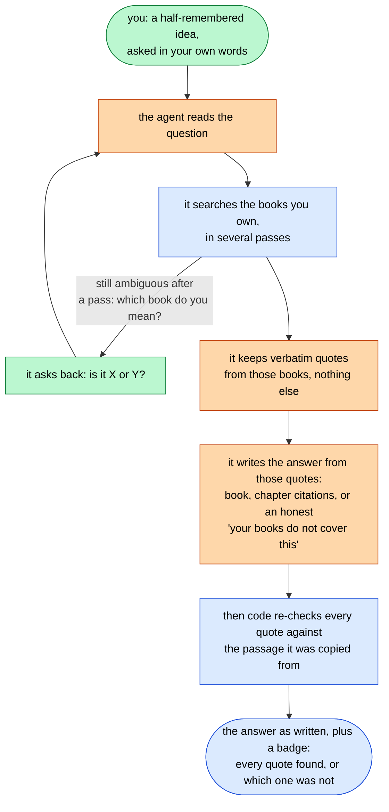
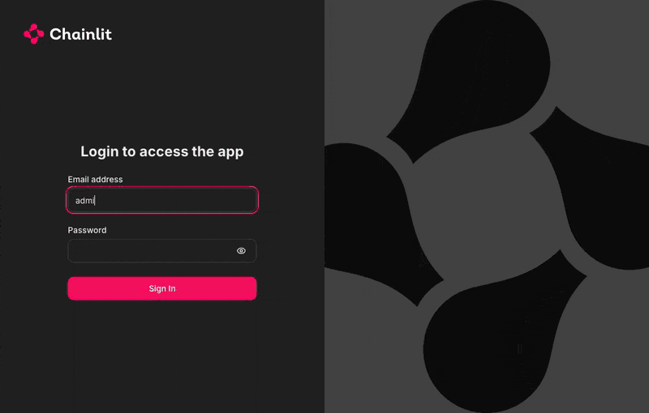

# Ask Your Library

[](https://github.com/ievgen-borysenko/ask-your-library/actions/workflows/ci.yml) [](https://github.com/ievgen-borysenko/ask-your-library/actions/workflows/security.yml) [](LICENSE)

Agentic RAG over a personal book library: you ask in your own words, a LangGraph agent answers
from the books you own with `[book, chapter]` citations, and plain code re-checks every quote it
used against the passage it was copied from.

- You remember the idea, not the book.
- The agent finds the passage in the books you own and quotes it verbatim — checked by code, not
  by another model.
- When the question is ambiguous it asks back, and when your books do not cover it, it says so
  instead of inventing.

## See it work




*"I remember a book in which a man happened to end up on an island and came across cannibals.
What is the name of the book, and why did that happen?" — the default local model (qwen2.5:14b) on
the demo corpus, no API key. 147.7 s by the CLI's own metrics line in the last frame.*



*"What exactly did Dartangnan say before the fight with not 1 but 3 people? And why?" — the same
library in the web UI, this run on a hosted model (`LLM_BACKEND=openrouter` with Sonnet 4.6, which
is not the default and is what the $0.0724 on its metrics line paid for): the verified-quotes
badge, and the evidence passage under it.*

## Quick start on a Mac

```bash
git clone https://github.com/ievgen-borysenko/ask-your-library.git && cd ask-your-library
bash scripts/install-mac.sh --dry-run    # the plan, printed; nothing is changed
bash scripts/install-mac.sh              # mostly download time, + ~30 min for the demo corpus
```

Then the first question:

```bash
uv run ask-library "What does Marcus Aurelius say about anger?"
```

No account, no API key, nothing to pay: the answering model and the embeddings both run on your
own machine through Ollama, and the cost line under the answer reads $0.0000. A hosted model is
available (`bash scripts/install-mac.sh --hosted`) and is the only thing here that needs a key.

Every other system, the manual steps, your own books, the web UI and the eval commands:
[`docs/quick-start.md`](docs/quick-start.md).

## How it works

- Offline, on your machine: books become chapters from their own headings and chunks packed from
  whole sentences, then bge-m3 embeddings — local Ollama by default — in a LanceDB index that is
  searched both ways, vectors and BM25, fused with Reciprocal Rank Fusion.
- Only `observe` sees retrieved text, sanitized and cut to a budget; the loop sees distilled evidence.
- A 4-step budget, a CRAG-style stop after 2 dry steps, drill-down, one clarify interrupt per run.
- Catalogue questions skip retrieval; the count is the length of the list read from the tables (ADR-016).
- `validate` is plain code: a quote must be a contiguous whole-token run of the passage it names,
  and it only reports — it never gates or edits the answer, which `synthesize` has already written.

The whole system, offline and online, and the loop's control flow at the level of the code's own
routing conditions are drawn node by node, with the decision records behind them, in
[`docs/architecture.md`](docs/architecture.md).

## Measured

| Measurement | Core v0.2.0-rc1 (11 questions, 2,500 + gate) | Extended v0.1.0 | Extended v0.2.0-rc1 |
|---|---|---|---|
| Retriever window, single-book presence | 8/8 | 12/12 | 12/12 |
| Retriever window, multi-book full coverage | 2/2 | 3/5 | 3/5 |
| Agent eval, questions completed | 11/11 | 21/21 | 21/21 |
| Behavioural compliance (heuristic scorer: titles, refusal, clarify, drill-down) | 11/11 | 17/21 | 18/21 |
| Answer quality, correct / incorrect / incomplete ([how each run was graded](docs/evaluation.md)) | 10 / 0 / 1 | not scored | not scored |
| Quote provenance, validator v0.1: confirmed / unattributed / broken | 47 / 0 / 0 | 53 / 0 / 0 | 73 / 0 / 0 |
| Clarify where the golden requires it | 1/1 | 0/2 | 1/2 |
| Chapter drill-down where expected | not in set | 0/1 | 0/1 |
| Cost per question, mean (Sonnet 4.6 via OpenRouter, configured rates) | $0.049 | $0.027 | $0.043 |

**Every number in this table was measured on the hosted configuration** (`LLM_BACKEND=openrouter`,
Sonnet 4.6), which is what the cost row prices. The **default configuration is local and free** —
a different answering model, so a different system, and none of these numbers describes it.
Measure your own model before trusting it: `uv run eval/run_agent_eval.py` names the backend it
ran with in every report's fingerprint.

Quote provenance is not faithfulness, and not correctness: a green row says every quote is
verbatim in the passage it cites, not that the answer reasons well from it. Single runs on tagged
trees, what the green numbers do not prove, the ablation that separates the loop from the model's
own memory, and the catalogue set: [`docs/evaluation.md`](docs/evaluation.md). The reports
themselves are in [`docs/eval-results/`](docs/eval-results/).

## Privacy and cost

- **Do you need an API key?** No. The default configuration answers on a local model through
  Ollama and embeds locally: no account, no key, nothing to pay, and the cost lines read $0.0000.
  A hosted answering model (`LLM_BACKEND=openrouter`) is an option, not a requirement; choose it
  and it needs a key and costs what [`docs/cost.md`](docs/cost.md) works out —
  [`docs/configuration.md`](docs/configuration.md).
- Run this on your own machine, over books you legally own.
- By default nothing leaves the machine: the answering model and the embeddings both run on this
  Ollama, and with tracing off there is no other path out. Set `LLM_BACKEND=openrouter` and the
  question **and the retrieved corpus fragments** go to that provider, and on to the model vendor.
- A question on the default local model costs **nothing**. On the hosted one it costs roughly
  **$0.04-0.05 on the demo set** at v0.2.0-rc1; `validate` is free in both, it is plain code.
- Designed for **localhost, single user**, not for internet exposure — the full text, the four injection layers and their limits: [`docs/privacy-and-threat-model.md`](docs/privacy-and-threat-model.md), [`docs/cost.md`](docs/cost.md).

## Docs

| Page | What is in it |
|---|---|
| [`docs/overview.md`](docs/overview.md) | What the project is, in full, and what it does |
| [`docs/quick-start.md`](docs/quick-start.md) | Install on any system, the demo corpus, the CLI, the web UI, the eval commands |
| [`docs/configuration.md`](docs/configuration.md) | Every environment variable, and the fully local, no-account setup |
| [`docs/add-your-own-books.md`](docs/add-your-own-books.md) | `ayl-add`: book keys, chapters, what is skipped, staged re-indexing |
| [`docs/evaluation.md`](docs/evaluation.md) | The two harnesses, three golden sets, the measured runs and the ablation |
| [`docs/privacy-and-threat-model.md`](docs/privacy-and-threat-model.md) | Data flow, threat model, the four injection layers and their limits |

Everything else is under [`docs/`](docs/): the architecture and its decision records, what a
question costs, the known limits, two end-to-end example traces, every eval report verbatim, the
diagram sources, the backlog and the changelog.

## Status and licence

`v0.2.0`, the first public release; the release history is in
[`docs/CHANGELOG.md`](docs/CHANGELOG.md) and the open gaps in
[`docs/backlog.md`](docs/backlog.md).

The code and the project's own files are under Apache-2.0 (`LICENSE`, attribution in
[`NOTICE`](NOTICE)); one file in the tree is somebody else's — Chainlit's own
`.chainlit/translations/en-US.json`, Apache-2.0, copied here with a single string changed, which
[`NOTICE`](NOTICE) and [`.chainlit/translations/README.md`](.chainlit/translations/README.md)
record.

The demo corpus is built from Project Gutenberg texts and LibriVox recordings, public domain in the
United States by their sources' own statements; what that means for a given edition or translation
in your country, and what exactly is committed here (machine transcripts, book cards, tables of
contents, two synthetic canaries), is in [`corpus/README.md`](corpus/README.md).

If this project helps your work, please credit Ievgen Borysenko and link to this repository.
