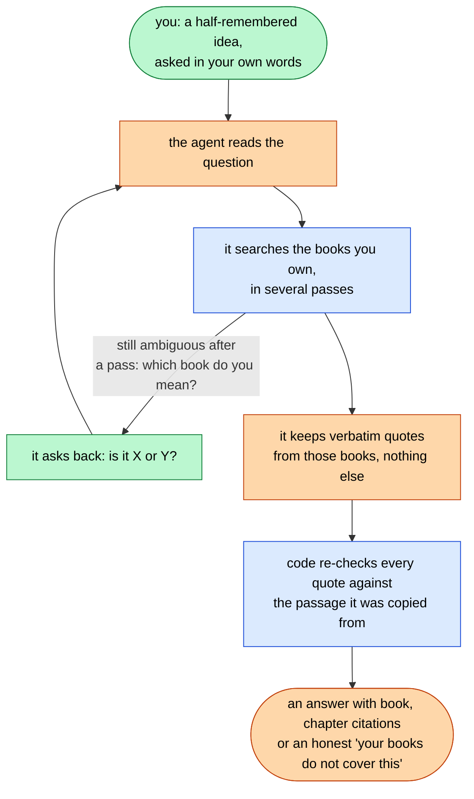
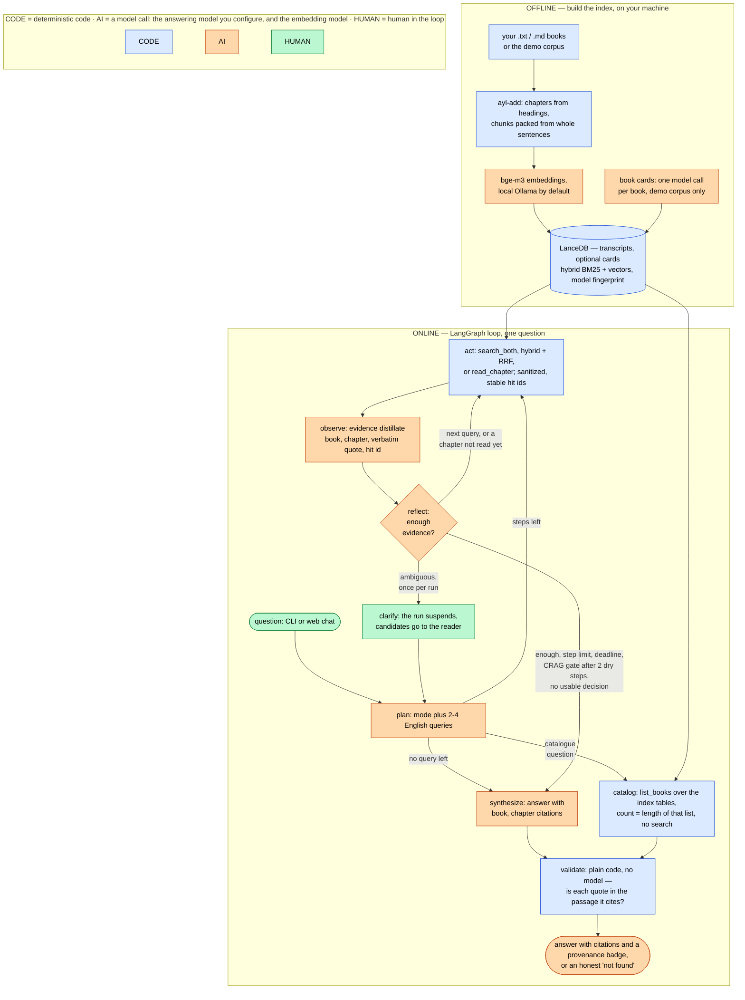

# Ask Your Library

Agentic RAG over a personal book library: you ask in your own words, a LangGraph agent answers
from the books you own with `[book, chapter]` citations, and plain code re-checks every quote it
used against the passage it was copied from.

- You remember the idea, not the book.
- The agent finds the passage in the books you own and quotes it verbatim — checked by code, not
  by another model.
- When the question is ambiguous it asks back, and when your books do not cover it, it says so
  instead of inventing.

## See it work



<!-- demo GIF: docs/img/ask-library-demo.gif, added when recorded -->

## Quick start on a Mac

```bash
git clone https://github.com/ievgen-borysenko/ask-your-library.git && cd ask-your-library
bash scripts/install-mac.sh --dry-run    # the plan, printed; nothing is changed
bash scripts/install-mac.sh              # mostly download time, + ~30 min for the demo corpus
```

Then the first question:

```bash
uv run ask-library "What does Marcus Aurelius say about anger?"
```

Every other system, the manual steps, your own books, the web UI and the eval commands:
[`docs/quick-start.md`](docs/quick-start.md).

## How it works



- Two corpora in one LanceDB, each table stamped with the embedding model that built it.
- Each corpus is searched twice, vectors and BM25, and the lists are fused with Reciprocal Rank Fusion.
- Only `observe` sees retrieved text, sanitized and cut to a budget; the loop sees distilled evidence.
- `validate` is plain code: a quote must be a contiguous whole-token run of the passage it names.
- Catalogue questions skip retrieval; the count is the length of the list read from the tables (ADR-016).
- A 4-step budget, a CRAG-style stop after 2 dry steps, drill-down, one clarify interrupt per run.
- Per-node calls, tokens and USD after every question, with selectivity and redaction counts.
- Node by node, with the decision records behind it: [`docs/architecture.md`](docs/architecture.md).

## Measured

| Measurement | Core v0.1.0 (12 questions, window 1,200) | Core v0.2.0-rc1 (11 questions, 2,500 + gate) | Extended v0.1.0 | Extended v0.2.0-rc1 |
|---|---|---|---|---|
| Retriever window, single-book presence | 9/9 | 8/8 | 12/12 | 12/12 |
| Retriever window, multi-book full coverage | 2/2 | 2/2 | 3/5 | 3/5 |
| Agent eval, questions completed | 12/12 | 11/11 | 21/21 | 21/21 |
| Behavioural compliance (heuristic scorer: titles, refusal, clarify, drill-down) | 12/12 | 11/11 | 17/21 | 18/21 |
| Answer quality, correct / incorrect / incomplete ([how each run was graded](docs/evaluation.md)) | 9 / 1 / 2 | 10 / 0 / 1 | not scored | not scored |
| Quote provenance, validator v0.1: confirmed / unattributed / broken | 46 / 0 / 0 | 47 / 0 / 0 | 53 / 0 / 0 | 73 / 0 / 0 |
| Clarify where the golden requires it | 1/1 | 1/1 | 0/2 | 1/2 |
| Chapter drill-down where expected | not in set | not in set | 0/1 | 0/1 |
| Cost per question, mean (Sonnet 4.6 via OpenRouter, configured rates) | $0.035 | $0.049 | $0.027 | $0.043 |

Quote provenance is not faithfulness, and not correctness: a green row says every quote is
verbatim in the passage it cites, not that the answer reasons well from it. Single runs on tagged
trees, what the green numbers do not prove, the ablation that separates the loop from the model's
own memory, and the catalogue set: [`docs/evaluation.md`](docs/evaluation.md). The reports
themselves are in [`docs/eval-results/`](docs/eval-results/).

## Privacy and cost

- **Do you need an API key?** Only for the answering model: the default is hosted (OpenRouter), and
  a key covers it. Indexing and embeddings are local and need no account, and with
  `LLM_BACKEND=ollama` nothing needs one at all —
  [`docs/configuration.md`](docs/configuration.md), [`docs/cost.md`](docs/cost.md).
- Run this on your own machine, over books you legally own.
- The question **and retrieved corpus fragments** go to the answering model's provider; embeddings are computed **locally** by Ollama by default.
- With `LLM_BACKEND=ollama`, local embeddings and tracing off, nothing leaves the machine at all.
- A typical question costs roughly **$0.04-0.05 on the demo set** at v0.2.0-rc1; `validate` is free, it is plain code.
- Designed for **localhost, single user**, not for internet exposure — the full text, the four injection layers and their limits: [`docs/privacy-and-threat-model.md`](docs/privacy-and-threat-model.md), [`docs/cost.md`](docs/cost.md).

## Docs

| Page | What is in it |
|---|---|
| [`docs/overview.md`](docs/overview.md) | What the project is, in full, and what it does |
| [`docs/quick-start.md`](docs/quick-start.md) | Install on any system, the demo corpus, the CLI, the web UI, the eval commands |
| [`docs/configuration.md`](docs/configuration.md) | Every environment variable, and the fully local, no-account setup |
| [`docs/add-your-own-books.md`](docs/add-your-own-books.md) | `ayl-add`: book keys, chapters, what is skipped, staged re-indexing |
| [`docs/evaluation.md`](docs/evaluation.md) | The two harnesses, three golden sets, the measured runs and the ablation |
| [`docs/privacy-and-threat-model.md`](docs/privacy-and-threat-model.md) | Data flow, threat model, the four injection layers and their limits |

Everything else is under [`docs/`](docs/): the architecture and its decision records, what a
question costs, the known limits, two end-to-end example traces, every eval report verbatim, the
diagram sources, the backlog and the changelog.

## Status and licence

`v0.2.0`, the first public release; the release history is in
[`docs/CHANGELOG.md`](docs/CHANGELOG.md) and the open gaps in
[`docs/backlog.md`](docs/backlog.md).

The code and the project's own files are under Apache-2.0 (`LICENSE`, attribution in `NOTICE`).
The demo corpus is built from Project Gutenberg texts and LibriVox recordings, public domain in the
United States by their sources' own statements; what that means for a given edition or translation
in your country, and what exactly is committed here (machine transcripts, book cards, tables of
contents, two synthetic canaries), is in [`corpus/README.md`](corpus/README.md).

If this project helps your work, please credit Ievgen Borysenko and link to this repository.
