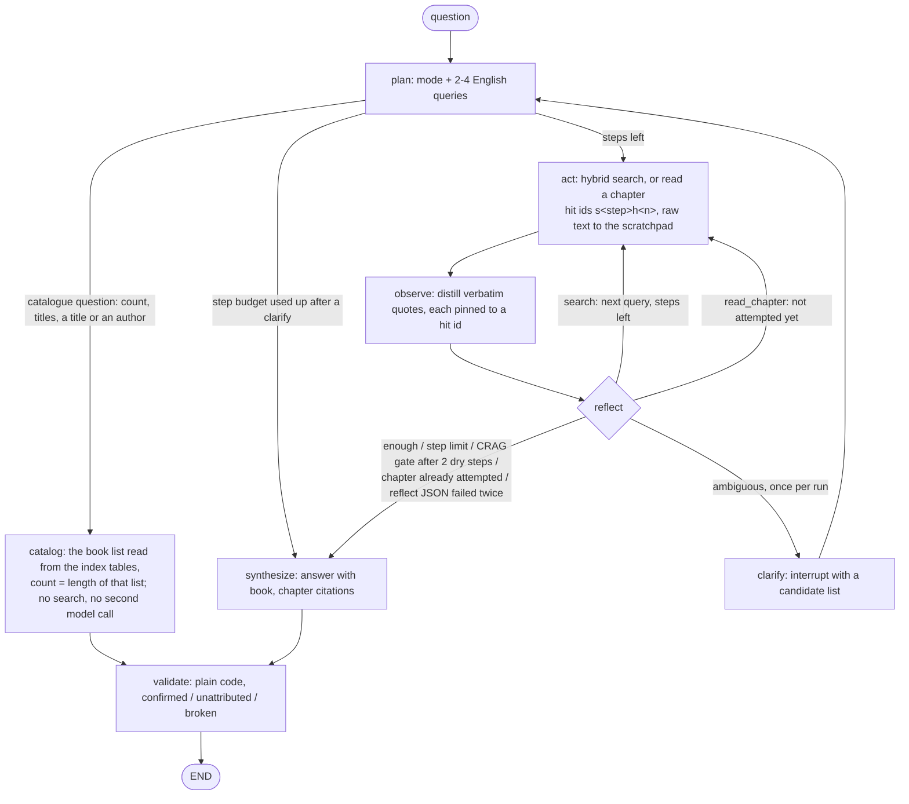

# Architecture

The graph, the retrieval, the catalogue path and the quote check in full; the README draws
the same graph as one diagram.



```
question -> planner queries (2-4, English) -> LanceDB hybrid search (vectors + BM25, RRF)
         -> observe distills verbatim quotes -> synthesize answers with citations
         -> validate re-checks every collected evidence quote against the passage it was copied from
```

The decisions behind this shape, and the alternative each one replaced, are recorded as ADRs
in [`adr/README.md`](adr/README.md), each with the measurement that settled it.

- **Hybrid retrieval.** Each corpus is searched twice (vector top-20 and BM25 top-20 from the
  LanceDB FTS index) and the lists are fused with Reciprocal Rank Fusion implemented in
  `library.py`, not via LanceDB's built-in rerankers. Manual RRF keeps the fusion transparent
  and score-scale free: only a chunk's rank in each list matters, so cosine distance and BM25
  never have to be calibrated against each other. A broken FTS index degrades to vector-only
  with a warning rather than silently.
- **Catalogue questions bypass retrieval (ADR-016).** `plan` recognises them in its one call and
  names the operation (`count`, `list`, `has` a title, `by_author`); `library.list_books()` reads
  the distinct book keys of both tables (the demo's canary fixtures excluded by their `source`
  column); code validates the operation, resolves a title or an author against that list
  (exact, contained as whole words, or a close match for a typo) and formats the answer, so
  nothing can be listed that is not in the index and a count is the length of the same list a
  listing shows. Containment reads one way: a name inside a title is a match, a title inside a
  longer name is not, in either mode: "Dracula's Guest" and "Dracula II" are different books,
  answered with a no and the closest title — for titles that is settled before the typo step,
  which on its own is close enough to confirm one ("Dracula II" is 0.824 alike to "Dracula"),
  while an author name that contains a held one still resolves ("Sir Arthur Conan Doyle" is the
  man on the shelf). The same resolver limits a content question that names one book to that
  book (a name that fits several books, or only a fragment of a title, sets no filter and claims
  nothing). The listing is exhaustive or it is an error: the full-text table is required here, as
  it is for the preflight. An operation
  the planner invents falls back to the research loop, and so does a question that also asks
  about content ("Do I have Dracula, and why does Harker stay?"): a conservative gate on content
  vocabulary sends it to the research loop, with the named book as the filter when the request
  carries a title that resolves to one book. "Who" is one of those words ("and who kills
  Lucy?"), except where it asks who wrote them: there the author is a catalogue attribute and
  the listing "Title — Author" answers that half itself. The gate reads the reader's words, not
  the library's (one mention of the title of a book the catalogue holds is taken out of the
  question before the check, so "Do I have Where the Wild Things Are?" is a holdings question
  and a book called "Why" keeps the reader's own "why"), but it knows
  words, not titles hidden in a question, so that routing stays the planner's reading, which
  the catalogue eval set measures with negative controls. The list never reaches the model: not
  in the answer, and not on a later turn (the conversation memory keeps only the operation and
  counts).
- **Only `observe` sees retrieved text, sanitized and cut to a fixed budget.** `act` writes the
  sanitized passages, cut to the same budget, to a per-run scratchpad (a human-readable log) and
  keeps each passage, as observe saw it, in state under a stable hit id; plan, reflect and synthesize work on the distilled evidence,
  never on raw hits.
- **Embedding index fingerprint.** Ingest stamps every table with the embedding model and
  dimensionality; readers refuse an index built by another model, which otherwise degrades
  retrieval silently when the dims happen to match.

## Quote provenance (not faithfulness, and not correctness)

`validate` is plain code, no LLM. Every retrieved passage gets a stable id when it is fetched
(`s<step>h<n>`), and `observe` must name the id of the passage each quote was copied from; the
book and section on an evidence item are then taken from that passage's record, never from the
model's own words. `validate` checks that the WHOLE quote, as a normalized token sequence
(punctuation and case folded, so honest typographic changes pass while paraphrase fails; signs,
range dashes and separators inside numbers are kept, with "1,200" and "1.200" treated as the
same number), is a contiguous whole-token run of the cited passage exactly as the model saw it. Three outcomes, a
partition of the evidence checked: **confirmed** (found in the cited passage), **unattributed**
(not in the cited passage, but found in another retrieved passage - reported, never counted as
confirmed) and **broken** (found in no retrieved passage). Every evidence item is checked, whether or
not the answer names its book (an answer may cite "Dracula" for the index key "Dracula — Bram Stoker");
items for books the answer does not name are counted separately for information. There is no section or
title substring matching and no fallback that confirms; the human-readable scratchpad is a log, not
an input to the check. The UI badge is green only when both unattributed and broken are zero, and
under it every evidence item opens to the passage it was checked against (verdict, book, section,
hit id, the quote, the retrieved text); `ask-library --verbose` prints the same list.

What this rules out: a fabricated sentence appended to a real one, two distant sentences
spliced into one "quote", a quote filed under the wrong passage, and service text from the
run log posing as a source. What it does not rule out is a model that copies a passage
faithfully and reasons wrongly from it.

**This verifies provenance, not correctness.** It proves the agent did not invent its evidence,
and says nothing about whether the answer is right. Concrete example: if a character in the book
lies and the agent quotes that lie verbatim from the correct chapter, provenance passes at 100%
and the answer is still factually wrong. Correctness is a human check (see [Evaluation](evaluation.md)).

The numbers under [Evaluation](evaluation.md) come from this validator (runs on the `v0.1.0` and `v0.2.0-rc1` code).

## Project layout

```
src/ask_your_library/  agent package: graph, nodes, model client (llm.py), prompts, clarify
                       resolver, coverage gate, provenance engine, hybrid search, embeddings,
                       index fingerprint, sanitizer, preflight, runner, CLI, i18n
  ingest/              chapter splitting, chunking, LanceDB rows, FTS index, staged
                       publishing, and add_folder.py - the `ayl-add` folder ingest
scripts/               ingest_demo_corpus.py - staged, cached corpus build
corpus/                manifest.yaml (checksums), book cards, canaries, audio transcripts,
                       toc/ (committed chapter titles; the card-grounding test uses them)
eval/                  retrieval eval, agent eval, injection canary, golden sets, report summarizer
tests/                 unit tests and the golden-set / manifest CI guard
docs/                  backlog.md (known gaps, v0.2), CHANGELOG.md, adr/ (decision records),
                       eval-results/, examples/
.github/workflows/     CI: unit tests on every push, UI contracts with the chainlit extra
ui.py                  Chainlit web chat
```
