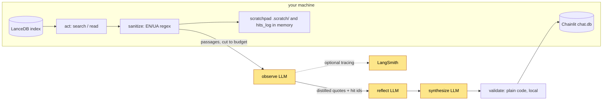

# Privacy, data flow and threat model

What leaves the machine, what the injection layers do and do not cover, and what this is not
designed for.

## Privacy and data flow

Run this on your own machine, over books you legally own.

Yellow boxes leave the machine (the LLM provider, optionally LangSmith); everything else stays local.

- The question **and retrieved corpus fragments** go to the orchestrator LLM provider -
  OpenRouter by default, and on to the model vendor. Point `OPENROUTER_BASE_URL` elsewhere to
  change that, or set `LLM_BACKEND=ollama`: with local embeddings (the default) and tracing off,
  nothing leaves the machine at all.
- A catalogue answer (the list of your books) is computed locally from the index tables and is
  not sent to the provider; the conversation memory keeps only its shape (the operation and the
  counts, and the name you asked about), so a later question does not carry the titles either.
  Two different guarantees: the list never reaches the *model*; a *tracing exporter*, when you
  enable one, receives the graph state, the catalogue list and the answer included, like every
  other run's state. Keep tracing off (the recipe under [Configuration](configuration.md)) if the list must stay
  on the machine.
- Embeddings are computed **locally** by Ollama by default; nothing leaves the machine for
  retrieval. `EMBED_BACKEND=openrouter` sends chunk text to the embedding API too.
- Every run writes a scratchpad with the **retrieved passages as the model saw them** (sanitized,
  cut to 2,500 characters per search hit and 12,000 per chapter read; `SEARCH_HIT_CHARS` and
  `CHAPTER_HIT_CHARS` in the environment set the two cuts) to `.scratch/` (gitignored,
  never cleaned up automatically).
- The Chainlit UI stores chats, questions and answers included, in `.chainlit/chat.db` (SQLite).
- Optional LangSmith tracing (`LANGCHAIN_API_KEY`, or `LANGSMITH_API_KEY` with `LANGSMITH_TRACING`)
  sends prompts and retrieved text to LangSmith; `LANGSMITH_TRACING_V2=false` and
  `LANGCHAIN_TRACING_V2=false` together keep it off.

All local storage is persistent, plaintext and unencrypted. There is no retention policy and no
cleanup command.

## Threat model

Designed for **localhost, single user**. Not designed for internet exposure:

- No rate limiting, no spend cap beyond `MAX_OUTPUT_TOKENS` per call and the per-question deadline, no per-user budget. An
  exposed UI is an open bill.
- Chainlit auth is a single username/password pair: no multi-user isolation and no per-book
  entitlement check (the `canary-authz` book is a placeholder for a future entitlements PoC, not
  an enforcement mechanism).
- **Loopback is not private to your machine.** Any page open in your browser can send requests
  to `127.0.0.1` (it only has to guess the port), and a name it controls that resolves to
  `127.0.0.1` (DNS rebinding) makes those requests same-origin for the browser, carrying that
  name in the `Host` header. That is why the quick start's placeholder login is unsafe even with
  no port forwarding at all: such a page could post it and then read every thread. `ui.py`
  registers Starlette's `TrustedHostMiddleware`, so the server answers only to the Host headers
  `localhost` and `127.0.0.1` and returns 400 to anything else, which closes the rebinding route;
  the login cookie is `SameSite=strict`, which `ui.py` sets on Chainlit's cookie module itself
  (`CHAINLIT_COOKIE_SAMESITE` is read before `ui.py` is loaded under `chainlit run`, so neither
  the environment nor `.env` decides it). Set `CHAINLIT_PASSWORD` anyway. `allow_origins` in
  `.chainlit/config.toml` is a CORS list, i.e. what a cross-origin page may *read*, and never a
  substitute for either.
- The injection layers cover instructions embedded in the *corpus*. They do not protect against
  a hostile *user*, do not cover paraphrased or non-EN/UA injections, and do not make the
  XML-like data blocks a boundary.
- `get_chapter`'s filters are `lancedb.expr` expressions pushed down as expressions, so the
  model-supplied book and section travel as literals and no SQL is rendered here. The one
  interpolated filter that still takes model-supplied input is `library.search`'s book filter
  (`_sql_quote`, quotes escaped): a known rough edge, recorded in `backlog.md`
  (`index_meta.py` interpolates too, but only the configured table name).

## Injection defense

Four layers, all partial:

1. **Regex sanitizer** (`sanitize.py`) redacts instruction-like lines from retrieved text before
   the model sees it, and counts redactions as telemetry.
2. **System/data separation.** Rules live in the system message; question, conversation, results
   and evidence go in the user message wrapped in XML-like `<result>` / `<evidence>` blocks,
   with an explicit rule that they are data.
3. **Output schemas.** Nodes return small JSON objects that are validated and degraded
   (malformed items dropped, not crashed on).
4. **Canary test** (`eval/injection_canary.py`), three outcomes: `BLOCKED` (evidence extracted,
   no canary - pass), `CONTAINED` (no evidence at all, or an empty/broken output: the dry-step
   fallback held but the injection disrupted the step, exit 2, not a pass), `FAILED` (canary
   leaked into evidence, exit 1).

What the canary covers. Five of its six stages are deterministic and free (`--no-live` runs all
available stages, and CI runs them in the `test-ui` job): the sanitizer; the `observe` controls;
the **prompt boundary** - a fake transport records the LLM prompts of `observe`, `reflect` and
`synthesize`, plus the clarify interrupt (`clarify` sends no prompt of its own, it only
interrupts), on a state whose evidence `why`/`quote`, book and section titles, queued queries
and clarify candidates all carry a marker and try to forge a delimiter, and the marker must
appear only inside data-block bodies or neutralized attributes of the *user* message, never in
the system message, with every untrusted `<` neutralized and no forged `<result>` /
`<evidence>`; the **test's own detection** - the
injection is planted in the evidence field each node really puts in its prompt (`why` for
`reflect`, `quote` for `synthesize`), each fake model asserts it actually received the marker
before echoing it, and an echo must be reported `FAILED`, a benign output `BLOCKED`, so a pass
cannot be an artefact of a blind check; and the **UI render path** - an answer and a clarify
question carrying a markdown image, a reference image and raw HTML come out inert, and so do the
two fragments the UI builds as HTML itself: the provenance badge on a broken quote and the
metrics footer on a stop reason, each carrying a blank line and an image reference.
The UI stage needs the `ui` extra; without it the stage reports `SKIPPED`, the run ends
`CANARY MECHANICS INCOMPLETE` and exits 3 unless `--allow-skipped` is passed - an incomplete run
is never reported as a pass.
What it does not cover: those stages say nothing about whether a hosted model resists an
injection. Live resistance is checked for `observe` only, by the last stage, the single paid
call in the file.

Limits: the regex layer covers English and Ukrainian phrasings only, so paraphrase, other
languages and unicode obfuscation walk past it into layer 2. The XML-like delimiters are a
prompting convention, not a security boundary - nothing enforces them. The canary exercises one
injection, not a suite.
