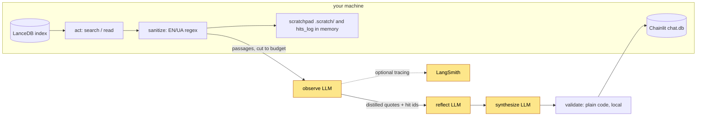

# Privacy, data flow and threat model

What leaves the machine, what the injection layers do and do not cover, and what this is not
designed for.

## Privacy and data flow

Run this on your own machine, over books you legally own.

Yellow boxes are the ones that CAN leave the machine (a hosted LLM provider, optionally
LangSmith); everything else stays local. **In the shipped configuration none of them do**:
`LLM_BACKEND=ollama` and `EMBED_BACKEND=ollama` are the defaults, tracing is off unless you set a
key, and the diagram's yellow describes what the hosted alternative would send.

That sentence is asserted, and only for what the assertion covers — read it as: *in the process
that answers your question (`runner.run_question` with the real preflight, embedder and graph),
every network call made through Python's socket module goes to the local Ollama endpoint*. It is
not a claim about the whole machine. **Ollama** is a separate process and decides for itself what
it does with a prompt. **Chainlit** is not exercised by the test at all (the `ui` extra is not
installed in the legs that run it), and its dependency tree carries `grpcio` and an OTLP gRPC
exporter, which network from C. **The browser** and Chainlit's JavaScript bundle are not sockets
of this process. And **native code** in general is the guard's blind spot: a C extension with its
own sockets, or a `ctypes` call straight into libc, never passes through the socket module where
the audit events are raised. The test environment is checked to contain no such package, and the
blind spot itself is pinned by a deliberately-failing control, so the limit is recorded rather
than assumed away. Details below.

- The question **and retrieved corpus fragments** stay on this machine by default: the
  orchestrator LLM is a local model served by Ollama. Set `LLM_BACKEND=openrouter` and both go to
  OpenRouter, and on to the model vendor; `OPENROUTER_BASE_URL` points that elsewhere if you have
  another OpenAI-compatible endpoint.
- A catalogue answer (the list of your books) is computed locally from the index tables and is
  not sent to the provider; the conversation memory keeps only its shape (the operation and the
  counts, and the name you asked about), so a later question does not carry the titles either.
  Two different guarantees: the list never reaches the *model*; a *tracing exporter*, when you
  enable one, receives the graph state, the catalogue list and the answer included, like every
  other run's state. Keep tracing off (the recipe under [Configuration](configuration.md)) if the list must stay
  on the machine.
- Embeddings are computed **locally** by Ollama by default; nothing leaves the machine for
  retrieval. `EMBED_BACKEND=openrouter` sends chunk text to the embedding API too.
- Every run writes a scratchpad with the **retrieved passages as the model saw them** (sanitized,
  cut to 2,500 characters per search hit and 12,000 per chapter read; `SEARCH_HIT_CHARS` and
  `CHAPTER_HIT_CHARS` in the environment set the two cuts) to `.scratch/` (gitignored,
  never cleaned up automatically).
- The Chainlit UI stores chats, questions and answers included, in `.chainlit/chat.db` (SQLite).
- Optional LangSmith tracing (`LANGCHAIN_API_KEY`, or `LANGSMITH_API_KEY` with `LANGSMITH_TRACING`)
  sends prompts and retrieved text to LangSmith; `LANGSMITH_TRACING_V2=false` and
  `LANGCHAIN_TRACING_V2=false` together keep it off.

All local storage is persistent, plaintext and unencrypted. There is no retention policy and no
cleanup command.

**The "nothing leaves the machine" claim is tested on one path, and the test says exactly which.**
`tests/test_egress_local.py` instruments the Python process with an egress guard
(`tests/egress_guard.py`) and then runs the package's own answering path in the shipped
configuration (`LLM_BACKEND=ollama`, `EMBED_BACKEND=ollama`, tracing off, no credentials) with
Ollama *not* running: the real `preflight.check_environment()`, the real `embeddings` embedder,
and the real compiled graph through `runner.run_question` — the path the CLI and the eval harness
take, and the one the web UI's Python half calls into.

The floor of the guard is CPython's own socket audit hook (`sys.addaudithook`), not a set of
monkeypatches: the interpreter raises `socket.connect`, `socket.sendto`, `socket.sendmsg`,
`socket.bind`, `socket.getaddrinfo`, `socket.gethostbyname`, `socket.gethostbyaddr` and
`socket.getnameinfo` from the C layer for every socket, whatever its class or import path, which
covers a raw `_socket` object, a resolver function captured by value, a UDP datagram that never
calls `connect` at all, and anything a background thread does. On top of it sits one httpx
transport layer (in both installed httpx distributions), so a hosted call is refused while its URL
is still intact and before any name lookup. Everything is recorded, loopback included; everything
that is not loopback is refused. A bind is recorded and never refused — it is the other direction —
so the test can also say no listening socket was opened on a public interface. Records are
streamed to a file as each attempt happens, and a refusal is written before it is raised, so an
`except` inside the application cannot erase the fact that it tried.

**What the guard sees is every network call made through Python's socket module** — the standard
library, `requests`, urllib3, httpx, httpcore, asyncio and the model client's SDK, which is every
client this project has. **What it does not see is a call that reaches libc without passing
through CPython**: a native extension with its own C sockets, or a `ctypes` call into
`getaddrinfo` or `connect`. Two tests keep that from being a hole in the claim.
`test_a_ctypes_call_into_libc_is_the_known_blind_spot` performs the bypass and is marked
`xfail(strict)`, so the limit is pinned: if some future interpreter or sandbox closes the door,
that test starts passing and forces this paragraph to be rewritten.
`test_no_native_networking_in_the_interpreter` and
`test_no_native_networking_in_the_locked_runtime` close the practical half — no
`grpcio`, `pycurl`, `pycares`, `aiodns`, `uvloop`, `pyzmq`, `psycopg`, `pymongo` or `redis` is
installed in the interpreter that runs these tests, and none is in the application's own locked
runtime closure. The first of the two skips itself, with the reason stated, in an interpreter
that has the `ui` extra installed (a developer's working environment, and the `ui-smoke` job):
that tree carries `grpcio`, and an interpreter holding it was never inside this claim — which is
the same fact as the exclusion of Chainlit below, not a new exception to it. The second runs
everywhere and must pass: the extra can excuse an environment, never the application's own
dependencies. `uvloop` is the sharpest of those: it replaces asyncio's event loop wholesale, so
every asyncio socket in the process would stop passing through the socket module. None arrives
with the application; `grpcio` and an OTLP gRPC exporter do arrive with the **`ui` extra**, which
is why the Chainlit process is excluded from the claim rather than merely untested.

On the reference run the guard recorded 14 attempts, all to loopback on the configured Ollama
port: preflight's `/api/tags`, the embedder's `/api/embed`, and the planner's call with its two
retries, each seen at the socket floor and, for the model calls, at the httpx layer above it. No
OpenRouter, no LangSmith, and no name lookup for either — a DNS query is itself a packet leaving
the machine, so a blocked host is refused before the resolver is asked about it. The run then
fails on the unreachable local runtime (preflight exits 5, the question ends in a connection error
to that endpoint) rather than falling back to a hosted call. Controls keep that silence
meaningful: the guard catching a deliberate outbound request at each door, a module that connects
while it is being imported, the same run with a usable-looking `OPENROUTER_API_KEY` present, and
the same graph with `LLM_BACKEND=openrouter`, where the guard records the attempt to
`openrouter.ai:443` and refuses it — proof that it sees what it claims to see. Both CI legs
(`test (ollama)` and `test (openrouter)`) run it, with no network and no Ollama.

**Its scope is one process, on one path.** Read the result as: *on the package's own runner path,
the application's Python process opens no connection to anything but the local Ollama endpoint it
is configured with*. It is not a claim about the machine, and not about every way this repository
can be started:

- **Chainlit is not exercised.** The `ui` extra is not installed in the CI legs that run this
  file, so `ui.py`, its server, its SQLite persistence and its own HTTP stack are outside these
  assertions — and that extra's tree brings `grpcio` and an OTLP gRPC exporter, which network from
  C, so a Chainlit process is one this guard could not speak for even if it ran there.
- **Native code is the blind spot.** Only calls through Python's socket module raise the audit
  events; a C extension with its own sockets, or `ctypes` into libc, does not. Pinned by an
  `xfail(strict)` control, and bounded by a test that asserts no known native-networking package
  is installed here or in the application's locked runtime closure.
- **Ollama is a separate process.** What it does with a prompt once it has it — a model pulled on
  demand, a telemetry ping, a remote inference backend someone configured — is outside the test.
- **The browser is not in it.** Chainlit ships a JavaScript bundle; what a page fetches is not a
  socket of this process.
- **A subprocess is not in it.** An audit hook is per interpreter, so anything this process spawns
  has its own sockets and is not instrumented.
- **`scripts/` is not in it.** `scripts/ingest_demo_corpus.py` downloads a corpus on purpose; that
  is a different path with a different claim.

## Threat model

Designed for **localhost, single user**. Not designed for internet exposure:

- No rate limiting, no spend cap beyond `MAX_OUTPUT_TOKENS` per call and the per-question deadline, no per-user budget. An
  exposed UI is an open bill.
- Chainlit auth is a single username/password pair: no multi-user isolation and no per-book
  entitlement check (the `canary-authz` book is a placeholder for a future entitlements PoC, not
  an enforcement mechanism).
- **Loopback is not private to your machine.** Any page open in your browser can send requests
  to `127.0.0.1` (it only has to guess the port), and a name it controls that resolves to
  `127.0.0.1` (DNS rebinding) makes those requests same-origin for the browser, carrying that
  name in the `Host` header. That is why the quick start's placeholder login is unsafe even with
  no port forwarding at all: such a page could post it and then read every thread. `ui.py`
  registers Starlette's `TrustedHostMiddleware`, so the server answers only to the Host headers
  `localhost` and `127.0.0.1` and returns 400 to anything else, which closes the rebinding route;
  the login cookie is `SameSite=strict`, which `ui.py` sets on Chainlit's cookie module itself
  (`CHAINLIT_COOKIE_SAMESITE` is read before `ui.py` is loaded under `chainlit run`, so neither
  the environment nor `.env` decides it). Set `CHAINLIT_PASSWORD` anyway. `allow_origins` in
  `.chainlit/config.toml` is a CORS list, i.e. what a cross-origin page may *read*, and never a
  substitute for either.
- The injection layers cover instructions embedded in the *corpus*. They do not protect against
  a hostile *user*, do not cover paraphrased or non-EN/UA injections, and do not make the
  XML-like data blocks a boundary.
- `get_chapter`'s filters are `lancedb.expr` expressions pushed down as expressions, so the
  model-supplied book and section travel as literals and no SQL is rendered here. The one
  interpolated filter that still takes model-supplied input is `library.search`'s book filter
  (`_sql_quote`, quotes escaped): a known rough edge, recorded in `backlog.md`
  (`index_meta.py` interpolates too, but only the configured table name).

## Injection defense

Four layers, all partial:

1. **Regex sanitizer** (`sanitize.py`) redacts instruction-like lines from retrieved text before
   the model sees it, and counts redactions as telemetry.
2. **System/data separation.** Rules live in the system message; question, conversation, results
   and evidence go in the user message wrapped in XML-like `<result>` / `<evidence>` blocks,
   with an explicit rule that they are data.
3. **Output schemas.** Nodes return small JSON objects that are validated and degraded
   (malformed items dropped, not crashed on).
4. **Canary test** (`eval/injection_canary.py`), three outcomes: `BLOCKED` (evidence extracted,
   no canary - pass), `CONTAINED` (no evidence at all, or an empty/broken output: the dry-step
   fallback held but the injection disrupted the step, exit 2, not a pass), `FAILED` (canary
   leaked into evidence, exit 1).

What the canary covers. Five of its six stages are deterministic and free (`--no-live` runs all
available stages, and CI runs them in the `test-ui` job): the sanitizer; the `observe` controls;
the **prompt boundary** - a fake transport records the LLM prompts of `observe`, `reflect` and
`synthesize`, plus the clarify interrupt (`clarify` sends no prompt of its own, it only
interrupts), on a state whose evidence `why`/`quote`, book and section titles, queued queries
and clarify candidates all carry a marker and try to forge a delimiter, and the marker must
appear only inside data-block bodies or neutralized attributes of the *user* message, never in
the system message, with every untrusted `<` neutralized and no forged `<result>` /
`<evidence>`; the **test's own detection** - the
injection is planted in the evidence field each node really puts in its prompt (`why` for
`reflect`, `quote` for `synthesize`), each fake model asserts it actually received the marker
before echoing it, and an echo must be reported `FAILED`, a benign output `BLOCKED`, so a pass
cannot be an artefact of a blind check; and the **UI render path** - an answer and a clarify
question carrying a markdown image, a reference image and raw HTML come out inert, and so do the
two fragments the UI builds as HTML itself: the provenance badge on a broken quote and the
metrics footer on a stop reason, each carrying a blank line and an image reference.
The UI stage needs the `ui` extra; without it the stage reports `SKIPPED`, the run ends
`CANARY MECHANICS INCOMPLETE` and exits 3 unless `--allow-skipped` is passed - an incomplete run
is never reported as a pass.
What it does not cover: those stages say nothing about whether a hosted model resists an
injection. Live resistance is checked for `observe` only, by the last stage, the single paid
call in the file.

A hostile *reader* is a different question from a hostile *passage*, and it has its own canary
(`eval/scope_canary.py`, #70): a request the library cannot answer - code, a translation,
arithmetic, a persona - must end in a refusal that names the library as the reason, decided at
`plan` and enforced by code, never in an answer from the model's own memory under this agent's
provenance footer. It is not an injection defense and does not make one: it only fences what this
agent agrees to be asked for. Its mechanics run in CI; the live run against the answering model is
pending ([`evaluation.md`](evaluation.md), "Scope canary").

Limits: the regex layer covers English and Ukrainian phrasings only, so paraphrase, other
languages and unicode obfuscation walk past it into layer 2. The XML-like delimiters are a
prompting convention, not a security boundary - nothing enforces them. The canary exercises one
injection, not a suite.
